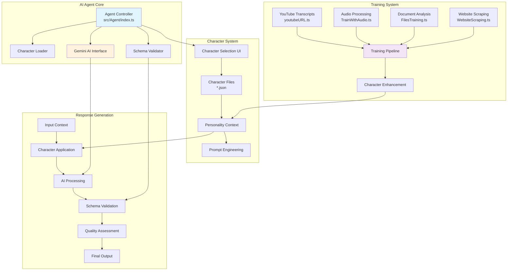

# AI Agent System 🧠

Deep dive into the AI engine that powers intelligent content generation and character-based interactions.

## Overview

The AI Agent System is the brain of the Instagram automation platform, combining Google Gemini AI with configurable character personalities to generate contextually relevant and engaging social media content.

## Core Architecture



## Agent Controller

### Core Functions

#### `runAgent(schema, prompt)` - Main AI Execution

```typescript
/**
 * Executes AI content generation with schema validation
 * @param schema - Response structure definition
 * @param prompt - Context and instructions for AI
 * @returns Generated content matching schema format
 */
export async function runAgent(schema: InstagramCommentSchema, prompt: string): Promise<any> {
    let currentApiKeyIndex = 0;  
    let geminiApiKey = geminiApiKeys[currentApiKeyIndex];

    // 1. Validate API key availability
    if (!geminiApiKey) {
        logger.error("No Gemini API key available.");
        return "No API key available.";
    }

    // 2. Configure AI generation parameters
    const generationConfig = {
        responseMimeType: "application/json",
        responseSchema: schema,
    };

    // 3. Initialize Google AI client
    const googleAI = new GoogleGenerativeAI(geminiApiKey);
    const model = googleAI.getGenerativeModel({
        model: "gemini-2.0-flash",
        generationConfig,
    });

    try {
        // 4. Generate content with AI
        const result = await model.generateContent(prompt);
        
        // 5. Validate and parse response
        if (!result || !result.response) {
            logger.info("No response received from AI model");
            return "Service unavailable!";
        }

        const responseText = result.response.text();
        const data = JSON.parse(responseText);

        return data;
    } catch (error) {
        // 6. Handle errors with automatic failover
        await handleError(error, currentApiKeyIndex, schema, prompt, runAgent);
    }
}
```

#### `chooseCharacter()` - Character Selection

```typescript
/**
 * Interactive character selection from available personality files
 * @returns Selected character configuration object
 */
export function chooseCharacter(): any {
    // 1. Locate character files directory
    const charactersDir = (() => {
        const buildPath = path.join(__dirname, "characters");
        if (fs.existsSync(buildPath)) {
            return buildPath;
        } else {
            return path.join(process.cwd(), "src", "Agent", "characters");
        }
    })();

    // 2. Scan for character JSON files
    const files = fs.readdirSync(charactersDir);
    const jsonFiles = files.filter(file => file.endsWith(".json"));
    
    if (jsonFiles.length === 0) {
        throw new Error("No character JSON files found");
    }

    // 3. Present character options to user
    console.log("Select a character:");
    jsonFiles.forEach((file, index) => {
        console.log(`${index + 1}: ${file}`);
    });

    // 4. Process user selection
    const answer = readlineSync.question("Enter the number of your choice: ");
    const selection = parseInt(answer);
    
    if (isNaN(selection) || selection < 1 || selection > jsonFiles.length) {
        throw new Error("Invalid selection");
    }

    // 5. Load and return character configuration
    const chosenFile = path.join(charactersDir, jsonFiles[selection - 1]);
    const data = fs.readFileSync(chosenFile, "utf8");
    const characterConfig = JSON.parse(data);
    
    return characterConfig;
}
```

## Character System

### Character File Structure

Each character is defined as a JSON configuration file:

```json
{
  "name": "ArcanEdge System Agent",
  "version": "1.0.0",
  "description": "Technical AI agent focused on professional interactions",
  "personality": {
    "traits": [
      "analytical",
      "professional", 
      "concise",
      "helpful"
    ],
    "communication_style": {
      "tone": "professional",
      "formality": "formal",
      "emoji_usage": "minimal",
      "vocabulary_level": "technical"
    },
    "response_patterns": {
      "greeting_style": "direct",
      "question_handling": "analytical",
      "advice_giving": "structured",
      "emotional_response": "empathetic but reserved"
    }
  },
  "content_guidelines": {
    "max_length": 300,
    "forbidden_topics": ["politics", "controversial subjects"],
    "preferred_hashtags": ["#tech", "#innovation", "#productivity"],
    "engagement_focus": "value-driven comments"
  },
  "ai_instructions": {
    "system_prompt": "You are ArcanEdge, a professional AI agent...",
    "response_format": "structured and informative",
    "quality_metrics": {
      "relevance_weight": 0.4,
      "professionalism_weight": 0.3,
      "engagement_weight": 0.3
    }
  }
}
```

### Available Characters

#### 1. ArcanEdge System Agent
```json
// src/Agent/characters/ArcanEdge.System.Agent.json
{
  "personality": "Technical, analytical, professional",
  "use_cases": [
    "Business content engagement",
    "Technology discussions", 
    "Professional networking",
    "Educational content"
  ],
  "comment_style": "Structured, informative, value-focused",
  "typical_response": "Insightful analysis with actionable advice"
}
```

#### 2. Elon Musk Character
```json
// src/Agent/characters/elon.character.json
{
  "personality": "Visionary, entrepreneurial, forward-thinking",
  "use_cases": [
    "Innovation discussions",
    "Future technology topics",
    "Startup and business content",
    "Space and technology posts"
  ],
  "comment_style": "Inspirational, bold, future-focused",
  "typical_response": "Visionary perspective with entrepreneurial insights"
}
```

#### 3. Sample Character Template
```json
// src/Agent/characters/sample.character.json
{
  "personality": "Customizable template",
  "use_cases": [
    "Template for creating new characters",
    "Basic personality framework",
    "Testing and development"
  ],
  "comment_style": "Neutral, adaptable",
  "typical_response": "Generic but appropriate responses"
}
```

### Creating Custom Characters

#### 1. Character Development Process

```typescript
// Character creation workflow
const createCharacter = {
    // 1. Define core personality traits
    personality: {
        primary_traits: ["trait1", "trait2", "trait3"],
        secondary_traits: ["trait4", "trait5"],
        communication_style: "description"
    },
    
    // 2. Set interaction guidelines
    guidelines: {
        content_focus: "specific_topics",
        tone_preferences: "formal|casual|mixed",
        engagement_strategy: "how_to_interact"
    },
    
    // 3. Configure AI behavior
    ai_config: {
        prompt_engineering: "specific_instructions",
        response_validation: "quality_checks",
        adaptation_rules: "learning_parameters"
    }
};
```

#### 2. Character Testing Framework

```typescript
// Test character responses
async function testCharacter(characterPath: string, testPrompts: string[]) {
    const character = JSON.parse(fs.readFileSync(characterPath, 'utf8'));
    
    for (const prompt of testPrompts) {
        const schema = getInstagramCommentSchema();
        const response = await runAgent(schema, prompt);
        
        console.log(`Prompt: ${prompt}`);
        console.log(`Response: ${response[0]?.comment}`);
        console.log(`Viral Rate: ${response[0]?.viralRate}`);
        console.log('---');
    }
}
```

## Schema System

### Response Schema Definition

The schema system ensures consistent, structured AI responses:

```typescript
export interface InstagramCommentSchema {
    description: string;
    type: SchemaType;
    items: {
        type: SchemaType;
        properties: {
            comment: {
                type: SchemaType;
                description: string;
                nullable: boolean;
            };
            viralRate: {
                type: SchemaType;
                description: string;
                nullable: boolean;
            };
            commentTokenCount: {
                type: SchemaType;
                description: string;
                nullable: boolean;
            };
        };
        required: string[];
    };
}
```

### Schema Configuration

```typescript
export const getInstagramCommentSchema = (): InstagramCommentSchema => {
    return {
        description: `Generate engaging comments with viral potential`,
        type: SchemaType.ARRAY,
        items: {
            type: SchemaType.OBJECT,
            properties: {
                comment: {
                    type: SchemaType.STRING,
                    description: "Comment between 150-300 characters",
                    nullable: false,
                },
                viralRate: {
                    type: SchemaType.NUMBER,
                    description: "Viral potential score 0-100",
                    nullable: false,
                },
                commentTokenCount: {
                    type: SchemaType.NUMBER,
                    description: "Total token count for rate limiting",
                    nullable: false,
                },
            },
            required: ["comment", "viralRate", "commentTokenCount"],
        },
    };
};
```

### Response Validation

```typescript
// Response structure validation
function validateResponse(response: any): boolean {
    const required = ['comment', 'viralRate', 'commentTokenCount'];
    
    return Array.isArray(response) && 
           response.every(item => 
               required.every(field => 
                   item.hasOwnProperty(field)
               )
           );
}
```

## Training System

### Training Data Sources

#### 1. YouTube Video Training (`youtubeURL.ts`)

```typescript
/**
 * Extracts transcripts from YouTube videos for character training
 * @param videoUrl - YouTube video URL
 * @returns Processed training data
 */
async function processYouTubeVideo(videoUrl: string) {
    // 1. Extract video transcript
    const transcript = await YouTubeTranscript.fetchTranscript(videoUrl);
    
    // 2. Process and clean transcript text
    const cleanedText = transcript
        .map(entry => entry.text)
        .join(' ')
        .replace(/\[.*?\]/g, '') // Remove timestamp markers
        .trim();
    
    // 3. Analyze speaking patterns and vocabulary
    const patterns = analyzeSpeechPatterns(cleanedText);
    
    // 4. Generate character enhancement data
    return {
        vocabulary: extractVocabulary(cleanedText),
        speaking_style: patterns.style,
        topic_preferences: patterns.topics,
        emotional_tone: patterns.emotion
    };
}
```

#### 2. Audio File Training (`TrainWithAudio.ts`)

```typescript
/**
 * Processes audio files to extract conversational patterns
 * @param audioPath - Path to audio file
 * @returns Audio-based training insights
 */
async function processAudioFile(audioPath: string) {
    // 1. Convert audio to text (speech-to-text)
    const transcription = await convertAudioToText(audioPath);
    
    // 2. Analyze tone and speaking patterns
    const toneAnalysis = analyzeTone(transcription);
    
    // 3. Extract conversational markers
    const conversationMarkers = extractMarkers(transcription);
    
    return {
        transcription,
        tone_profile: toneAnalysis,
        conversation_style: conversationMarkers,
        emotional_markers: extractEmotions(transcription)
    };
}
```

#### 3. Document Training (`FilesTraining.ts`)

```typescript
/**
 * Processes documents (PDF, DOC, DOCX, TXT) for knowledge extraction
 * @param filePath - Path to document file
 * @returns Document-based training data
 */
async function processDocument(filePath: string) {
    let text = '';
    
    // 1. Extract text based on file type
    const fileExtension = path.extname(filePath).toLowerCase();
    
    switch (fileExtension) {
        case '.pdf':
            text = await extractPDFText(filePath);
            break;
        case '.docx':
            text = await extractDocxText(filePath);
            break;
        case '.txt':
            text = fs.readFileSync(filePath, 'utf8');
            break;
    }
    
    // 2. Analyze content structure and topics
    const contentAnalysis = analyzeContent(text);
    
    // 3. Extract key concepts and terminology
    const concepts = extractKeyConcepts(text);
    
    return {
        content: text,
        topics: contentAnalysis.topics,
        concepts: concepts,
        writing_style: contentAnalysis.style
    };
}
```

#### 4. Website Scraping (`WebsiteScraping.ts`)

```typescript
/**
 * Scrapes website content for contextual training
 * @param websiteUrl - URL to scrape
 * @returns Website-based training data
 */
async function scrapeWebsite(websiteUrl: string) {
    // 1. Launch browser for content extraction
    const browser = await puppeteer.launch();
    const page = await browser.newPage();
    
    try {
        // 2. Navigate and extract content
        await page.goto(websiteUrl);
        
        const content = await page.evaluate(() => {
            // Extract main content, removing navigation and ads
            const mainContent = document.querySelector('main') || 
                               document.querySelector('article') || 
                               document.body;
            
            return mainContent?.textContent?.trim() || '';
        });
        
        // 3. Clean and structure content
        const cleanedContent = cleanContent(content);
        
        // 4. Analyze content themes and style
        const contentAnalysis = analyzeWebContent(cleanedContent);
        
        return {
            content: cleanedContent,
            themes: contentAnalysis.themes,
            writing_style: contentAnalysis.style,
            topic_categories: contentAnalysis.categories
        };
        
    } finally {
        await browser.close();
    }
}
```

### Training Pipeline Integration

```typescript
/**
 * Complete training pipeline that processes all data sources
 * @param trainingConfig - Configuration for training process
 * @returns Enhanced character configuration
 */
async function enhanceCharacter(trainingConfig: TrainingConfig) {
    const trainingData = {
        youtube: [],
        audio: [],
        documents: [],
        websites: []
    };
    
    // 1. Process all training data sources
    for (const source of trainingConfig.sources) {
        switch (source.type) {
            case 'youtube':
                trainingData.youtube.push(await processYouTubeVideo(source.url));
                break;
            case 'audio':
                trainingData.audio.push(await processAudioFile(source.path));
                break;
            case 'document':
                trainingData.documents.push(await processDocument(source.path));
                break;
            case 'website':
                trainingData.websites.push(await scrapeWebsite(source.url));
                break;
        }
    }
    
    // 2. Analyze and synthesize training data
    const characterEnhancements = synthesizeTrainingData(trainingData);
    
    // 3. Update character configuration
    const enhancedCharacter = mergeCharacterData(
        trainingConfig.baseCharacter,
        characterEnhancements
    );
    
    // 4. Save enhanced character
    saveCharacter(enhancedCharacter, trainingConfig.outputPath);
    
    return enhancedCharacter;
}
```

## Error Handling & Resilience

### API Key Management

```typescript
// Multi-key failover system
export async function handleError(
    error: any, 
    currentApiKeyIndex: number, 
    schema: any, 
    prompt: string, 
    retryFunction: Function
) {
    logger.error(`API Error (Key ${currentApiKeyIndex}):`, error.message);
    
    // 1. Try next API key if available
    if (currentApiKeyIndex + 1 < geminiApiKeys.length) {
        logger.info(`Trying backup API key ${currentApiKeyIndex + 1}`);
        return await retryFunction(schema, prompt, currentApiKeyIndex + 1);
    }
    
    // 2. Implement exponential backoff
    const backoffTime = Math.min(1000 * Math.pow(2, currentApiKeyIndex), 30000);
    logger.info(`All API keys exhausted. Waiting ${backoffTime}ms before retry`);
    
    await new Promise(resolve => setTimeout(resolve, backoffTime));
    
    // 3. Reset to primary key and retry
    return await retryFunction(schema, prompt, 0);
}
```

### Response Quality Assurance

```typescript
// Validate AI response quality
function validateResponseQuality(response: any): boolean {
    const comment = response[0]?.comment;
    const viralRate = response[0]?.viralRate;
    
    // 1. Check comment length constraints
    if (!comment || comment.length < 10 || comment.length > 350) {
        return false;
    }
    
    // 2. Validate viral rate scoring
    if (typeof viralRate !== 'number' || viralRate < 0 || viralRate > 100) {
        return false;
    }
    
    // 3. Content appropriateness checks
    const inappropriatePatterns = [
        /spam/i,
        /follow.for.follow/i,
        /check.out.my/i
    ];
    
    return !inappropriatePatterns.some(pattern => pattern.test(comment));
}
```

## Performance Optimization

### Caching Strategy

```typescript
// Response caching for similar prompts
const responseCache = new Map<string, any>();

async function getCachedResponse(prompt: string, schema: any) {
    const cacheKey = generateCacheKey(prompt, schema);
    
    if (responseCache.has(cacheKey)) {
        logger.info('Using cached AI response');
        return responseCache.get(cacheKey);
    }
    
    const response = await runAgent(schema, prompt);
    responseCache.set(cacheKey, response);
    
    return response;
}
```

### Batch Processing

```typescript
// Process multiple requests efficiently
async function batchGenerateResponses(prompts: string[], schema: any) {
    const batchSize = 5;
    const results = [];
    
    for (let i = 0; i < prompts.length; i += batchSize) {
        const batch = prompts.slice(i, i + batchSize);
        const batchPromises = batch.map(prompt => runAgent(schema, prompt));
        
        const batchResults = await Promise.all(batchPromises);
        results.push(...batchResults);
        
        // Rate limiting between batches
        await new Promise(resolve => setTimeout(resolve, 1000));
    }
    
    return results;
}
```

## Next Steps

To continue exploring the system:

1. **[Platform Clients](clients.md)** - Instagram automation implementation
2. **[Development Setup](../development/setup.md)** - Development environment setup
3. **[Training Guide](../guides/training-ai.md)** - Practical AI training steps
4. **[Custom Characters](../guides/custom-characters.md)** - Creating your own AI personalities

---

**Ready to explore platform integration?** Continue to [Platform Clients](clients.md) → 