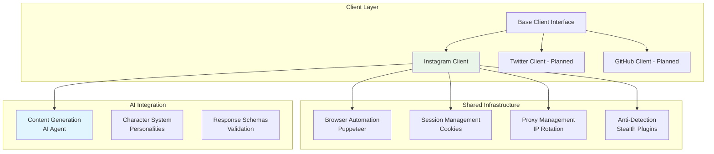

# Platform Clients 🌐

Documentation for the platform-specific automation clients and their implementation details.

## Overview

The platform client layer handles all direct interactions with social media platforms. Each client is designed as a self-contained module that can operate independently while sharing common infrastructure components.

## Client Architecture



## Instagram Client (`Instagram.ts`)

### Core Features

The Instagram client is the primary implementation handling all Instagram automation:

#### 1. Authentication & Session Management

```typescript
/**
 * Handles Instagram login with cookie persistence
 * Located in src/client/Instagram.ts
 */
async function loginWithCredentials(page: any, browser: Browser) {
    try {
        // 1. Navigate to Instagram login page
        await page.goto("https://www.instagram.com/accounts/login/");
        await page.waitForSelector('input[name="username"]');

        // 2. Fill credentials from environment variables
        await page.type('input[name="username"]', IGusername);
        await page.type('input[name="password"]', IGpassword);
        await page.click('button[type="submit"]');

        // 3. Wait for successful navigation
        await page.waitForNavigation();

        // 4. Save session cookies for future use
        const cookies = await browser.cookies();
        await saveCookies("./cookies/Instagramcookies.json", cookies);
        
        logger.info("Login successful, cookies saved");
    } catch (error) {
        logger.error("Login failed:", error);
        throw error;
    }
}
```

#### 2. Content Interaction Pipeline

```typescript
/**
 * Main interaction loop that processes Instagram posts
 * Integrates AI-powered comment generation with human-like automation
 */
async function interactWithPosts(page: any) {
    let postIndex = 1;
    const maxPosts = 50; // Configurable interaction limit
    
    while (postIndex <= maxPosts) {
        try {
            // 1. Locate post element using CSS selectors
            const postSelector = `article:nth-of-type(${postIndex})`;
            
            if (!(await page.$(postSelector))) {
                console.log("No more posts found. Ending iteration...");
                return;
            }

            // 2. Handle post liking with state checking
            const likeButtonSelector = `${postSelector} svg[aria-label="Like"]`;
            const likeButton = await page.$(likeButtonSelector);
            const ariaLabel = await likeButton?.evaluate((el: Element) =>
                el.getAttribute("aria-label")
            );

            if (ariaLabel === "Like") {
                await likeButton.click();
                console.log(`Post ${postIndex} liked.`);
            }

            // 3. Extract post caption for AI processing
            const captionSelector = `${postSelector} div.x9f619 span._ap3a div span._ap3a`;
            const captionElement = await page.$(captionSelector);
            
            let caption = "";
            if (captionElement) {
                caption = await captionElement.evaluate((el: HTMLElement) => el.innerText);
            }

            // 4. Generate AI-powered comment
            const prompt = `Craft a thoughtful, engaging comment for: "${caption}". 
                           Keep it under 300 characters and make it genuine.`;
            const schema = getInstagramCommentSchema();
            const result = await runAgent(schema, prompt);
            const comment = result[0]?.comment;

            // 5. Post the generated comment
            const commentBoxSelector = `${postSelector} textarea`;
            const commentBox = await page.$(commentBoxSelector);
            
            if (commentBox && comment) {
                await commentBox.type(comment);
                
                // Find and click post button
                const postButton = await page.evaluateHandle(() => {
                    const buttons = Array.from(document.querySelectorAll('div[role="button"]'));
                    return buttons.find(button => 
                        button.textContent === 'Post' && 
                        !button.hasAttribute('disabled')
                    );
                });

                if (postButton) {
                    await postButton.click();
                    console.log(`Comment posted on post ${postIndex}.`);
                }
            }

            // 6. Human-like delay before next interaction
            const waitTime = Math.floor(Math.random() * 5000) + 5000;
            await delay(waitTime);

            // 7. Scroll to next post
            await page.evaluate(() => {
                window.scrollBy(0, window.innerHeight);
            });

            postIndex++;
        } catch (error) {
            console.error(`Error interacting with post ${postIndex}:`, error);
            break;
        }
    }
}
```

### Anti-Detection Features

#### 1. Stealth Configuration

```typescript
import StealthPlugin from "puppeteer-extra-plugin-stealth";
import AdblockerPlugin from "puppeteer-extra-plugin-adblocker";

// Apply stealth plugins to avoid detection
puppeteer.use(StealthPlugin());
puppeteer.use(AdblockerPlugin({
    interceptResolutionPriority: DEFAULT_INTERCEPT_RESOLUTION_PRIORITY,
}));
```

#### 2. Randomized Behavior

```typescript
// Human-like interaction timing
const delay = (ms: number) => new Promise(resolve => setTimeout(resolve, ms));

// Randomized wait times between actions
const waitTime = Math.floor(Math.random() * 5000) + 5000; // 5-10 seconds

// Variable scrolling patterns
await page.evaluate(() => {
    const scrollAmount = Math.floor(Math.random() * 200) + window.innerHeight;
    window.scrollBy(0, scrollAmount);
});
```

#### 3. Proxy Integration

```typescript
// Proxy server setup for IP rotation
const server = new Server({ port: 8000 });
await server.listen();
const proxyUrl = `http://localhost:8000`;

const browser = await puppeteer.launch({
    headless: false,
    args: [`--proxy-server=${proxyUrl}`],
});
```

## Future Platform Clients

### Twitter Client (Planned)

```typescript
// Future implementation structure
export class TwitterClient {
    private browser: Browser;
    private page: Page;
    
    async initialize() {
        // 1. Setup Twitter-specific browser configuration
        // 2. Handle Twitter authentication
        // 3. Configure Twitter-specific selectors
    }
    
    async tweetWithAI(prompt: string) {
        // 1. Generate tweet content using AI
        // 2. Post tweet with media if needed
        // 3. Monitor engagement
    }
    
    async engageWithTweets() {
        // 1. Browse Twitter timeline
        // 2. Generate contextual replies
        // 3. Like and retweet relevant content
    }
}
```

### GitHub Client (Planned)

```typescript
// Future implementation structure
export class GitHubClient {
    private apiClient: Octokit;
    
    async initialize() {
        // 1. Setup GitHub API authentication
        // 2. Configure repository access
        // 3. Initialize AI for code review
    }
    
    async reviewPullRequests() {
        // 1. Scan for new pull requests
        // 2. Generate AI-powered code reviews
        // 3. Post constructive feedback
    }
    
    async contributeToIssues() {
        // 1. Find relevant issues
        // 2. Generate helpful responses
        // 3. Provide code suggestions
    }
}
```

## Client Development Patterns

### 1. Base Client Interface

```typescript
interface PlatformClient {
    // Core lifecycle methods
    initialize(): Promise<void>;
    authenticate(): Promise<void>;
    shutdown(): Promise<void>;
    
    // Content interaction methods
    generateContent(context: string): Promise<string>;
    postContent(content: string): Promise<boolean>;
    engageWithContent(): Promise<void>;
    
    // Session management
    saveSession(): Promise<void>;
    loadSession(): Promise<boolean>;
    
    // Error handling
    handleError(error: Error): Promise<void>;
}
```

### 2. Common Utilities

```typescript
// Shared utility functions across all clients
export class ClientUtils {
    static async randomDelay(min: number, max: number): Promise<void> {
        const delay = Math.floor(Math.random() * (max - min)) + min;
        return new Promise(resolve => setTimeout(resolve, delay));
    }
    
    static async retryOperation<T>(
        operation: () => Promise<T>,
        maxRetries: number = 3
    ): Promise<T> {
        for (let i = 0; i < maxRetries; i++) {
            try {
                return await operation();
            } catch (error) {
                if (i === maxRetries - 1) throw error;
                await this.randomDelay(1000 * Math.pow(2, i), 2000 * Math.pow(2, i));
            }
        }
        throw new Error('Max retries exceeded');
    }
    
    static sanitizeContent(content: string, platform: string): string {
        // Platform-specific content sanitization
        switch (platform) {
            case 'instagram':
                return content.substring(0, 300); // Instagram comment limit
            case 'twitter':
                return content.substring(0, 280); // Twitter character limit
            default:
                return content;
        }
    }
}
```

### 3. Error Handling Strategy

```typescript
export class PlatformError extends Error {
    constructor(
        message: string,
        public platform: string,
        public operation: string,
        public retryable: boolean = true
    ) {
        super(message);
        this.name = 'PlatformError';
    }
}

// Centralized error handling
export async function handlePlatformError(
    error: PlatformError,
    client: PlatformClient
): Promise<void> {
    logger.error(`${error.platform} error in ${error.operation}:`, error.message);
    
    if (error.retryable) {
        logger.info('Attempting retry...');
        await ClientUtils.randomDelay(5000, 15000);
        // Implement retry logic
    } else {
        logger.error('Non-retryable error, stopping operation');
        await client.shutdown();
    }
}
```

## Configuration & Customization

### Client-Specific Settings

```typescript
// Instagram client configuration
const instagramConfig = {
    maxPostsPerSession: 50,
    interactionDelayMin: 5000,
    interactionDelayMax: 10000,
    likeToCommentRatio: 0.3, // Like 30% of posts you comment on
    maxCommentsPerHour: 20,
    sessionCooldownMinutes: 30
};

// Twitter client configuration (planned)
const twitterConfig = {
    maxTweetsPerDay: 10,
    maxRepliesPerHour: 15,
    engagementCooldownMinutes: 45,
    hashtagStrategy: 'trending' // or 'niche', 'mixed'
};
```

### Selector Management

```typescript
// Platform-specific selectors (updateable for UI changes)
const InstagramSelectors = {
    loginForm: {
        username: 'input[name="username"]',
        password: 'input[name="password"]',
        submitButton: 'button[type="submit"]'
    },
    
    posts: {
        article: 'article',
        likeButton: 'svg[aria-label="Like"]',
        caption: 'div.x9f619 span._ap3a div span._ap3a',
        commentBox: 'textarea',
        postButton: 'div[role="button"]'
    },
    
    navigation: {
        homeLink: 'a[href="/"]',
        directMessages: 'a[href="/direct/inbox/"]'
    }
};
```

## Performance Optimization

### 1. Resource Management

```typescript
// Efficient browser resource usage
const browserConfig = {
    headless: process.env.NODE_ENV === 'production',
    args: [
        '--no-sandbox',
        '--disable-setuid-sandbox',
        '--disable-dev-shm-usage',
        '--disable-images', // Skip image loading for faster operation
        '--disable-javascript', // Disable JS when not needed
        '--memory-pressure-off',
        '--max_old_space_size=4096'
    ]
};
```

### 2. Session Persistence

```typescript
// Efficient session management
class SessionManager {
    private sessions: Map<string, any> = new Map();
    
    async saveSession(platform: string, sessionData: any): Promise<void> {
        const sessionPath = `./sessions/${platform}_session.json`;
        await fs.writeFile(sessionPath, JSON.stringify(sessionData, null, 2));
        this.sessions.set(platform, sessionData);
    }
    
    async loadSession(platform: string): Promise<any> {
        if (this.sessions.has(platform)) {
            return this.sessions.get(platform);
        }
        
        const sessionPath = `./sessions/${platform}_session.json`;
        try {
            const data = await fs.readFile(sessionPath, 'utf8');
            const sessionData = JSON.parse(data);
            this.sessions.set(platform, sessionData);
            return sessionData;
        } catch (error) {
            return null;
        }
    }
}
```

## Security Considerations

### 1. Rate Limiting

```typescript
class RateLimiter {
    private limits: Map<string, { count: number; resetTime: number }> = new Map();
    
    async checkLimit(operation: string, maxCount: number, windowMs: number): Promise<boolean> {
        const now = Date.now();
        const limit = this.limits.get(operation);
        
        if (!limit || now > limit.resetTime) {
            this.limits.set(operation, { count: 1, resetTime: now + windowMs });
            return true;
        }
        
        if (limit.count >= maxCount) {
            logger.warn(`Rate limit exceeded for ${operation}`);
            return false;
        }
        
        limit.count++;
        return true;
    }
}
```

### 2. Account Safety

```typescript
// Account protection measures
const safetyChecks = {
    async checkAccountStatus(page: Page): Promise<boolean> {
        // Check for restriction notifications
        const restrictionSelectors = [
            '[aria-label*="restricted"]',
            'text*="temporarily restricted"',
            'text*="unusual activity"'
        ];
        
        for (const selector of restrictionSelectors) {
            if (await page.$(selector)) {
                logger.error('Account restriction detected');
                return false;
            }
        }
        
        return true;
    },
    
    async detectCaptcha(page: Page): Promise<boolean> {
        const captchaSelectors = [
            '[data-testid="captcha"]',
            'iframe[title*="captcha"]',
            'text*="verify you\'re human"'
        ];
        
        for (const selector of captchaSelectors) {
            if (await page.$(selector)) {
                logger.warn('CAPTCHA detected, pausing automation');
                return true;
            }
        }
        
        return false;
    }
};
```

## Testing & Debugging

### 1. Client Testing Framework

```typescript
// Test utilities for platform clients
export class ClientTester {
    static async testAuthentication(client: PlatformClient): Promise<boolean> {
        try {
            await client.authenticate();
            logger.info('Authentication test passed');
            return true;
        } catch (error) {
            logger.error('Authentication test failed:', error);
            return false;
        }
    }
    
    static async testContentGeneration(client: PlatformClient): Promise<boolean> {
        try {
            const testPrompt = "Test post about technology and innovation";
            const content = await client.generateContent(testPrompt);
            
            if (content && content.length > 0) {
                logger.info('Content generation test passed');
                return true;
            }
            
            logger.error('Content generation test failed: empty content');
            return false;
        } catch (error) {
            logger.error('Content generation test failed:', error);
            return false;
        }
    }
}
```

### 2. Debug Mode

```typescript
// Enhanced debugging for development
if (process.env.DEBUG_MODE === 'true') {
    // Enable verbose logging
    logger.level = 'debug';
    
    // Slow down automation for debugging
    const originalDelay = ClientUtils.randomDelay;
    ClientUtils.randomDelay = async (min: number, max: number) => {
        await originalDelay(min * 2, max * 2); // Double delays in debug mode
    };
    
    // Take screenshots at key steps
    await page.screenshot({ 
        path: `debug/screenshot-${Date.now()}.png`,
        fullPage: true
    });
}
```

## Next Steps

To continue exploring the platform architecture:

1. **[Architecture Overview](overview.md)** - High-level system design
2. **[AI Agent System](ai-agent.md)** - AI engine implementation
3. **[Development Setup](../development/setup.md)** - Development environment
4. **[API Reference](../api/core.md)** - Function documentation

---

**Ready to develop your own client?** Check the [Development Setup](../development/setup.md) guide → 