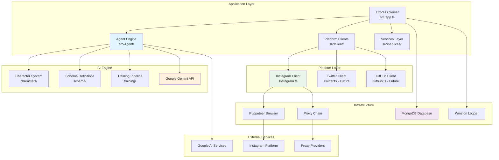
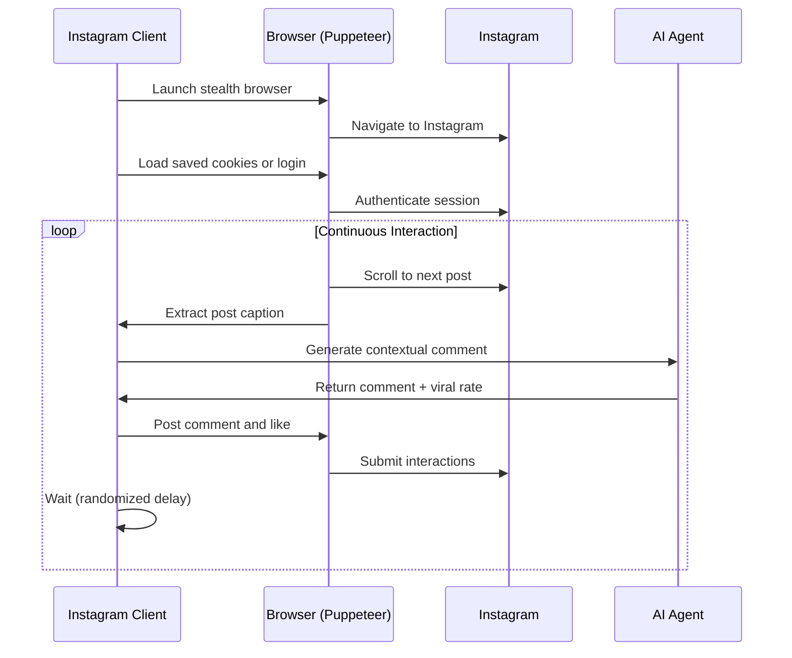
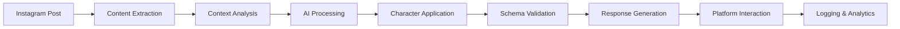
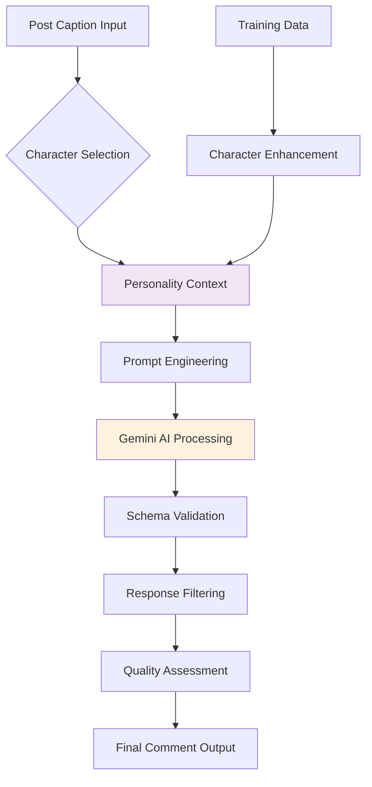
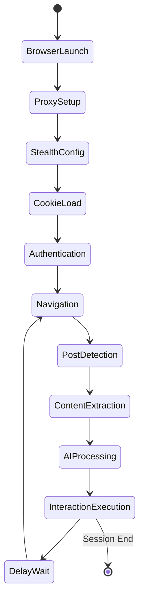

# Architecture Overview 🏗️

Understanding the Instagram AI Agent's system design, components, and data flow.

## System Architecture



## Core Components

### 1. Application Entry Point

#### `src/index.ts` - Main Entry
- **Purpose**: Application bootstrapping and lifecycle management
- **Responsibilities**:
  - Environment setup and validation
  - AI agent initialization
  - Express server startup
  - Graceful shutdown handling

```typescript
// 1. Load environment configuration
dotenv.config();

// 2. Initialize AI agent with character selection
await initAgent();

// 3. Start Express server
const server = app.listen(process.env.PORT || 3000);

// 4. Handle shutdown signals
process.on("SIGTERM", () => shutdown(server));
```

#### `src/app.ts` - Express Application
- **Purpose**: Web server configuration and middleware setup
- **Responsibilities**:
  - Security middleware (Helmet)
  - Request parsing and cookie handling
  - Database connection management
  - Continuous automation orchestration

### 2. AI Agent System

#### Agent Controller (`src/Agent/index.ts`)
- **Purpose**: Central AI coordination and Google Gemini integration
- **Key Functions**:
  - `runAgent()`: Execute AI content generation with schema validation
  - `chooseCharacter()`: Interactive character selection
  - `initAgent()`: Agent initialization and setup

```typescript
// 1. Load character personality configuration
const character = chooseCharacter();

// 2. Configure Gemini AI with response schema
const generationConfig = {
    responseMimeType: "application/json",
    responseSchema: schema,
};

// 3. Generate contextual content
const result = await model.generateContent(prompt);
```

#### Character System (`src/Agent/characters/`)
- **Purpose**: AI personality definitions and behavior configuration
- **Character Types**:
  - **ArcanEdge System Agent**: Technical, professional responses
  - **Elon Musk Character**: Entrepreneurial, visionary style
  - **Sample Character**: Basic template for customization

#### Schema Definitions (`src/Agent/schema/`)
- **Purpose**: Structured response formats and validation
- **Schema Components**:
  - Comment content and length constraints
  - Viral rate scoring (0-100)
  - Token counting for rate limiting
  - Database models for data persistence

### 3. Platform Client Layer

#### Instagram Client (`src/client/Instagram.ts`)
- **Purpose**: Instagram automation and interaction management
- **Core Workflow**:



**Key Features**:
- **Stealth Automation**: Anti-detection plugins and user agent rotation
- **Session Management**: Cookie persistence across restarts
- **Rate Limiting**: Randomized delays and interaction limits
- **Content Analysis**: Caption extraction and context understanding

### 4. Infrastructure Components

#### Database Layer (`src/config/db.ts`)
- **Technology**: MongoDB with Mongoose ODM
- **Purpose**: Session data, interaction logs, and configuration storage
- **Collections**:
  - User sessions and authentication state
  - Interaction history and analytics
  - AI training data and character configurations

#### Logging System (`src/config/logger.ts`)
- **Technology**: Winston with daily rotation
- **Features**:
  - Structured JSON logging
  - Multiple transport layers (file + console)
  - Automatic log rotation and retention
  - Error tracking and debugging support

#### Utility Functions (`src/utils/`)
- **Purpose**: Shared functionality and helper methods
- **Key Utilities**:
  - Cookie management and encryption
  - Error handling and retry logic
  - File operations and data processing
  - Network utilities and proxy management

## Data Flow Architecture

### 1. Request Flow



### 2. AI Processing Pipeline



### 3. Browser Automation Flow



## Security Architecture

### 1. Authentication & Authorization

- **Credential Management**: Environment variable isolation
- **Session Security**: Encrypted cookie storage
- **API Security**: Token-based Gemini AI authentication
- **Rate Limiting**: Built-in request throttling

### 2. Anti-Detection Measures

```typescript
// Stealth plugin configuration
puppeteer.use(StealthPlugin());
puppeteer.use(AdblockerPlugin());

// User agent rotation
const userAgent = new UserAgent();
await page.setUserAgent(userAgent.toString());

// Randomized interaction timing
const waitTime = Math.floor(Math.random() * 5000) + 5000;
```

### 3. Proxy Integration

- **IP Rotation**: Multiple proxy support
- **Geographic Distribution**: Location-based proxy selection
- **Connection Pooling**: Efficient proxy utilization
- **Failover Handling**: Automatic proxy switching

## Scalability Considerations

### 1. Horizontal Scaling

- **Multi-Instance Support**: Database-backed session sharing
- **Load Distribution**: Character-based workload partitioning
- **Resource Isolation**: Container-ready architecture

### 2. Performance Optimization

- **Memory Management**: Efficient browser instance handling
- **Connection Pooling**: Database and proxy connection reuse
- **Caching Strategy**: Session and configuration caching
- **Async Processing**: Non-blocking AI operations

### 3. Resource Management

```typescript
// Memory optimization
process.on('memoryUsage', () => {
    const usage = process.memoryUsage();
    if (usage.heapUsed > MAX_HEAP_SIZE) {
        logger.warn('High memory usage detected');
        // Implement cleanup or restart logic
    }
});

// Connection management
const dbOptions = {
    maxPoolSize: 10,
    minPoolSize: 2,
    maxIdleTimeMS: 30000
};
```

## Error Handling & Resilience

### 1. Error Recovery Patterns

- **Exponential Backoff**: Progressive retry delays
- **Circuit Breaker**: Service failure isolation
- **Graceful Degradation**: Reduced functionality during issues
- **Health Checks**: Automated system monitoring

### 2. Monitoring & Observability

- **Structured Logging**: JSON-formatted log entries
- **Performance Metrics**: Response time and success rate tracking
- **Error Tracking**: Detailed exception capturing
- **Usage Analytics**: Interaction patterns and AI performance

## Integration Points

### 1. External Service Integration

| Service | Purpose | Integration Method |
|---------|---------|-------------------|
| **Google Gemini AI** | Content generation | REST API with SDK |
| **Instagram Platform** | Social media automation | Web scraping with Puppeteer |
| **MongoDB** | Data persistence | Mongoose ODM |
| **Proxy Services** | IP rotation | HTTP/SOCKS proxy protocols |

### 2. Future Platform Support

The architecture is designed for multi-platform expansion:

- **Twitter Integration**: `src/client/Twitter.ts` (planned)
- **GitHub Automation**: `src/client/Github.ts` (planned)  
- **Plugin System**: Extensible client architecture
- **Universal AI Engine**: Platform-agnostic content generation

## Development Patterns

### 1. Code Organization

```
src/
├── Agent/           # AI engine and character system
├── client/          # Platform-specific automation
├── config/          # Configuration and infrastructure
├── services/        # Business logic layer  
├── utils/           # Shared utilities
└── types/           # TypeScript definitions
```

### 2. Design Principles

- **Separation of Concerns**: Clear layer boundaries
- **Dependency Injection**: Configurable service dependencies
- **Error Boundaries**: Isolated failure domains
- **Configuration-Driven**: Environment-based behavior control

## Next Steps

To dive deeper into specific components:

1. **[AI Agent System](ai-agent.md)** - Detailed AI engine documentation
2. **[Platform Clients](clients.md)** - Client implementation details
3. **[Development Setup](../development/setup.md)** - Development environment
4. **[Code Structure](../development/code-structure.md)** - Implementation patterns

---

**Ready to understand the AI engine?** Continue to [AI Agent System](ai-agent.md) → 