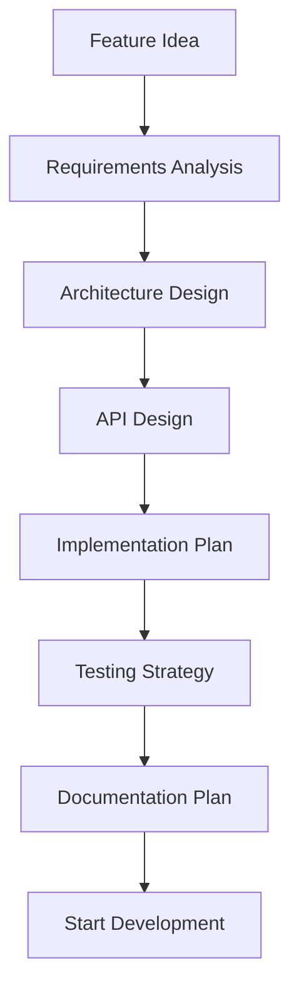

# Adding Features 🚀

Guide for extending the Instagram AI Agent platform with new functionality and platform integrations.

## Feature Development Workflow

### 1. Planning & Design

Before implementing new features:



#### Requirements Checklist

- [ ] **Clear Use Case**: What problem does this solve?
- [ ] **Target Users**: Who will use this feature?
- [ ] **Success Metrics**: How will you measure success?
- [ ] **Dependencies**: What other systems are involved?
- [ ] **Performance Impact**: Resource requirements?
- [ ] **Security Considerations**: Any security implications?

### 2. Development Environment Setup

```bash
# Create feature branch
git checkout -b feature/your-feature-name

# Set up development environment
npm run dev

# Run tests to ensure baseline functionality
npm test
```

## Adding New Platform Support

### 1. Platform Client Structure

Create a new platform client following the established pattern:

```typescript
// src/client/NewPlatform.ts
import { Browser, Page } from 'puppeteer';
import { PlatformClient } from '../types/PlatformClient';
import logger from '../config/logger';

export class NewPlatformClient implements PlatformClient {
    private browser: Browser;
    private page: Page;
    
    async initialize(): Promise<void> {
        // 1. Setup browser configuration
        this.browser = await puppeteer.launch({
            headless: process.env.HEADLESS_MODE === 'true',
            args: ['--no-sandbox', '--disable-setuid-sandbox']
        });
        
        this.page = await this.browser.newPage();
        
        // 2. Configure platform-specific settings
        await this.configurePlatformSettings();
    }
    
    async authenticate(): Promise<void> {
        // 1. Load saved session or login
        const hasValidSession = await this.loadSession();
        
        if (!hasValidSession) {
            await this.loginWithCredentials();
            await this.saveSession();
        }
    }
    
    async generateContent(context: string): Promise<string> {
        // 1. Use AI agent to generate platform-appropriate content
        const schema = getPlatformSchema('newplatform');
        const prompt = this.createPrompt(context);
        const result = await runAgent(schema, prompt);
        
        return result[0]?.content;
    }
    
    async postContent(content: string): Promise<boolean> {
        // 1. Navigate to content creation area
        // 2. Fill content form
        // 3. Submit content
        // 4. Verify successful posting
        
        try {
            await this.navigateToContentCreation();
            await this.fillContentForm(content);
            await this.submitContent();
            
            logger.info('Content posted successfully', { platform: 'newplatform' });
            return true;
        } catch (error) {
            logger.error('Failed to post content', { error, platform: 'newplatform' });
            return false;
        }
    }
    
    async engageWithContent(): Promise<void> {
        // 1. Browse platform feed
        // 2. Identify engagement opportunities
        // 3. Generate contextual responses
        // 4. Interact with content
        
        const posts = await this.getPlatformFeed();
        
        for (const post of posts) {
            const response = await this.generateResponse(post.content);
            await this.interactWithPost(post, response);
            
            // Rate limiting
            await this.delay(5000, 15000);
        }
    }
    
    // Platform-specific implementation methods
    private async configurePlatformSettings(): Promise<void> {
        // Configure user agent, viewport, etc.
    }
    
    private async loginWithCredentials(): Promise<void> {
        // Implement platform-specific login flow
    }
    
    private async loadSession(): Promise<boolean> {
        // Load cookies or session tokens
        return false;
    }
    
    private async saveSession(): Promise<void> {
        // Save authentication state
    }
    
    private createPrompt(context: string): string {
        return `Generate engaging content for ${context} on new platform.`;
    }
    
    // Additional helper methods...
}
```

### 2. Platform-Specific Configuration

```typescript
// src/config/platforms.ts
export const platformConfigs = {
    instagram: {
        maxContentLength: 300,
        maxPostsPerSession: 50,
        interactionDelay: { min: 5000, max: 10000 },
        selectors: {
            loginForm: 'input[name="username"]',
            contentInput: 'textarea',
            submitButton: 'button[type="submit"]'
        }
    },
    
    newplatform: {
        maxContentLength: 500,
        maxPostsPerSession: 30,
        interactionDelay: { min: 8000, max: 15000 },
        selectors: {
            loginForm: '#username-input',
            contentInput: '.content-editor',
            submitButton: '.post-button'
        }
    }
};
```

### 3. Platform Schema Definition

```typescript
// src/Agent/schema/newplatform.ts
import { SchemaType } from "@google/generative-ai";

export interface NewPlatformContentSchema {
    description: string;
    type: SchemaType;
    items: {
        type: SchemaType;
        properties: {
            content: {
                type: SchemaType;
                description: string;
                nullable: boolean;
            };
            tags: {
                type: SchemaType;
                description: string;
                nullable: boolean;
            };
            engagementScore: {
                type: SchemaType;
                description: string;
                nullable: boolean;
            };
        };
        required: string[];
    };
}

export const getNewPlatformContentSchema = (): NewPlatformContentSchema => {
    return {
        description: "Generate engaging content for new platform",
        type: SchemaType.ARRAY,
        items: {
            type: SchemaType.OBJECT,
            properties: {
                content: {
                    type: SchemaType.STRING,
                    description: "Platform-appropriate content up to 500 characters",
                    nullable: false,
                },
                tags: {
                    type: SchemaType.ARRAY,
                    description: "Relevant hashtags or topic tags",
                    nullable: true,
                },
                engagementScore: {
                    type: SchemaType.NUMBER,
                    description: "Predicted engagement score 0-100",
                    nullable: false,
                },
            },
            required: ["content", "engagementScore"],
        },
    };
};
```

## Adding AI Training Features

### 1. New Training Data Source

```typescript
// src/Agent/training/NewDataSource.ts
export class NewDataSourceTrainer {
    async processNewDataType(inputPath: string): Promise<TrainingData> {
        try {
            // 1. Extract data from new source
            const rawData = await this.extractData(inputPath);
            
            // 2. Clean and normalize data
            const cleanedData = await this.cleanData(rawData);
            
            // 3. Analyze patterns and extract insights
            const analysis = await this.analyzeData(cleanedData);
            
            // 4. Structure for character enhancement
            return {
                source: 'newdatasource',
                content: cleanedData,
                metadata: {
                    extractedAt: new Date().toISOString(),
                    inputPath: inputPath,
                    dataType: 'custom'
                },
                analysis: {
                    vocabulary: analysis.vocabulary,
                    patterns: analysis.patterns,
                    style: analysis.style
                }
            };
            
        } catch (error) {
            logger.error('Failed to process new data source', { error, inputPath });
            throw new TrainingError('Data processing failed', 'newdatasource', inputPath, 'processing');
        }
    }
    
    private async extractData(inputPath: string): Promise<string> {
        // Implement data extraction logic specific to new source
        // Examples: API calls, file parsing, web scraping
    }
    
    private async cleanData(rawData: string): Promise<string> {
        // Clean and normalize the extracted data
        return rawData
            .replace(/[^\w\s\.,!?]/g, '') // Remove special characters
            .replace(/\s+/g, ' ') // Normalize whitespace
            .trim();
    }
    
    private async analyzeData(data: string): Promise<any> {
        // Extract meaningful patterns from the data
        return {
            vocabulary: this.extractVocabulary(data),
            patterns: this.identifyPatterns(data),
            style: this.analyzeWritingStyle(data)
        };
    }
}
```

### 2. Enhanced Character System

```typescript
// src/Agent/characters/CharacterManager.ts
export class CharacterManager {
    private characters: Map<string, CharacterConfig> = new Map();
    
    async createCharacter(template: Partial<CharacterConfig>): Promise<string> {
        const characterId = this.generateCharacterId();
        
        const character: CharacterConfig = {
            id: characterId,
            name: template.name || 'Custom Character',
            version: '1.0.0',
            createdAt: new Date().toISOString(),
            personality: {
                traits: template.personality?.traits || ['friendly', 'helpful'],
                communication_style: template.personality?.communication_style || {
                    tone: 'casual',
                    formality: 'informal',
                    emoji_usage: 'moderate'
                }
            },
            training_data: [],
            performance_metrics: {
                engagement_rate: 0,
                response_quality: 0,
                consistency_score: 0
            }
        };
        
        this.characters.set(characterId, character);
        await this.saveCharacter(character);
        
        return characterId;
    }
    
    async enhanceCharacter(characterId: string, trainingData: TrainingData[]): Promise<void> {
        const character = this.characters.get(characterId);
        if (!character) {
            throw new Error(`Character ${characterId} not found`);
        }
        
        // Apply training data to enhance character
        for (const data of trainingData) {
            await this.applyTrainingData(character, data);
        }
        
        // Update performance metrics
        await this.updatePerformanceMetrics(character);
        
        // Save enhanced character
        await this.saveCharacter(character);
    }
    
    async evaluateCharacterPerformance(characterId: string): Promise<PerformanceMetrics> {
        // Analyze character's recent performance
        const character = this.characters.get(characterId);
        if (!character) {
            throw new Error(`Character ${characterId} not found`);
        }
        
        const recentInteractions = await this.getRecentInteractions(characterId);
        
        return {
            engagement_rate: this.calculateEngagementRate(recentInteractions),
            response_quality: this.calculateQualityScore(recentInteractions),
            consistency_score: this.calculateConsistencyScore(recentInteractions),
            improvement_suggestions: this.generateImprovementSuggestions(recentInteractions)
        };
    }
}
```

## Adding New AI Capabilities

### 1. Advanced Content Analysis

```typescript
// src/Agent/analysis/ContentAnalyzer.ts
export class ContentAnalyzer {
    async analyzeContent(content: string): Promise<ContentAnalysis> {
        return {
            sentiment: await this.analyzeSentiment(content),
            topics: await this.extractTopics(content),
            complexity: await this.analyzeComplexity(content),
            engagement_potential: await this.predictEngagement(content),
            brand_safety: await this.checkBrandSafety(content)
        };
    }
    
    private async analyzeSentiment(content: string): Promise<SentimentScore> {
        // Implement sentiment analysis
        // Can use external APIs or custom models
    }
    
    private async extractTopics(content: string): Promise<string[]> {
        // Topic extraction using NLP techniques
        // Keywords, entities, themes
    }
    
    private async predictEngagement(content: string): Promise<number> {
        // ML model to predict engagement likelihood
        // Based on historical data and content features
    }
}
```

### 2. Multi-Modal AI Integration

```typescript
// src/Agent/multimodal/MediaProcessor.ts
export class MediaProcessor {
    async processImage(imagePath: string): Promise<ImageAnalysis> {
        // Use vision AI to analyze images
        // Extract objects, text, emotions, etc.
        
        return {
            objects: await this.detectObjects(imagePath),
            text: await this.extractText(imagePath),
            emotions: await this.detectEmotions(imagePath),
            style: await this.analyzeStyle(imagePath),
            suggested_captions: await this.generateCaptions(imagePath)
        };
    }
    
    async processVideo(videoPath: string): Promise<VideoAnalysis> {
        // Analyze video content
        // Extract frames, audio, transcript
        
        return {
            transcript: await this.extractAudioTranscript(videoPath),
            key_frames: await this.extractKeyFrames(videoPath),
            emotions: await this.analyzeVideoEmotions(videoPath),
            topics: await this.identifyVideoTopics(videoPath)
        };
    }
    
    async generateMultiModalContent(
        textPrompt: string,
        mediaContext?: ImageAnalysis | VideoAnalysis
    ): Promise<MultiModalContent> {
        // Generate content that considers both text and media context
        
        const enhancedPrompt = this.enhancePromptWithMediaContext(textPrompt, mediaContext);
        
        return {
            text: await this.generateText(enhancedPrompt),
            suggested_media: await this.suggestMedia(enhancedPrompt),
            hashtags: await this.generateHashtags(enhancedPrompt),
            engagement_optimization: await this.optimizeForEngagement(enhancedPrompt)
        };
    }
}
```

## Adding Monitoring & Analytics

### 1. Performance Tracking

```typescript
// src/monitoring/PerformanceTracker.ts
export class PerformanceTracker {
    private metrics: Map<string, MetricHistory> = new Map();
    
    async trackInteraction(interaction: InteractionEvent): Promise<void> {
        // Record interaction details
        await this.recordEvent(interaction);
        
        // Update aggregated metrics
        await this.updateMetrics(interaction);
        
        // Check for anomalies
        await this.detectAnomalies(interaction);
    }
    
    async generateReport(timeframe: TimeFrame): Promise<PerformanceReport> {
        const interactions = await this.getInteractions(timeframe);
        
        return {
            summary: {
                total_interactions: interactions.length,
                success_rate: this.calculateSuccessRate(interactions),
                average_engagement: this.calculateAverageEngagement(interactions),
                error_rate: this.calculateErrorRate(interactions)
            },
            trends: await this.analyzeTrends(interactions),
            insights: await this.generateInsights(interactions),
            recommendations: await this.generateRecommendations(interactions)
        };
    }
    
    async optimizePerformance(): Promise<OptimizationSuggestions> {
        // Analyze performance data to suggest improvements
        const recentData = await this.getRecentPerformanceData();
        
        return {
            timing_adjustments: this.suggestTimingOptimizations(recentData),
            content_improvements: this.suggestContentImprovements(recentData),
            character_adjustments: this.suggestCharacterOptimizations(recentData),
            technical_optimizations: this.suggestTechnicalImprovements(recentData)
        };
    }
}
```

### 2. Real-time Monitoring

```typescript
// src/monitoring/RealTimeMonitor.ts
export class RealTimeMonitor {
    private alertThresholds: AlertThresholds;
    private notificationChannels: NotificationChannel[];
    
    async startMonitoring(): Promise<void> {
        // Monitor system health in real-time
        setInterval(async () => {
            await this.checkSystemHealth();
            await this.checkPerformanceMetrics();
            await this.checkErrorRates();
            await this.checkResourceUsage();
        }, 60000); // Check every minute
    }
    
    private async checkSystemHealth(): Promise<void> {
        const health = await this.getSystemHealth();
        
        if (health.status !== 'healthy') {
            await this.sendAlert({
                type: 'system_health',
                severity: health.severity,
                message: health.message,
                timestamp: new Date()
            });
        }
    }
    
    private async sendAlert(alert: Alert): Promise<void> {
        for (const channel of this.notificationChannels) {
            await channel.send(alert);
        }
        
        // Log alert
        logger.warn('Alert sent', { alert });
    }
}
```

## Testing New Features

### 1. Feature Testing Framework

```typescript
// tests/features/FeatureTest.ts
export class FeatureTest {
    async testNewPlatformIntegration(): Promise<TestResult> {
        const testCases = [
            { name: 'Authentication', test: this.testAuthentication },
            { name: 'Content Generation', test: this.testContentGeneration },
            { name: 'Content Posting', test: this.testContentPosting },
            { name: 'Engagement', test: this.testEngagement },
            { name: 'Error Handling', test: this.testErrorHandling }
        ];
        
        const results: TestResult[] = [];
        
        for (const testCase of testCases) {
            try {
                const result = await testCase.test();
                results.push({
                    name: testCase.name,
                    status: 'passed',
                    result: result
                });
            } catch (error) {
                results.push({
                    name: testCase.name,
                    status: 'failed',
                    error: error.message
                });
            }
        }
        
        return {
            overall_status: results.every(r => r.status === 'passed') ? 'passed' : 'failed',
            test_cases: results,
            timestamp: new Date()
        };
    }
    
    private async testAuthentication(): Promise<any> {
        // Test platform authentication
    }
    
    private async testContentGeneration(): Promise<any> {
        // Test AI content generation for new platform
    }
    
    // Additional test methods...
}
```

### 2. Integration Testing

```bash
#!/bin/bash
# scripts/test-new-feature.sh

echo "Testing new feature integration..."

# Run unit tests
npm run test:unit

# Run integration tests
npm run test:integration

# Run end-to-end tests
npm run test:e2e

# Test with different configurations
NODE_ENV=test npm run test:config

# Performance testing
npm run test:performance

# Security testing
npm run test:security

echo "Feature testing complete!"
```

## Documentation Requirements

### 1. Feature Documentation Template

```markdown
# Feature Name

## Overview
Brief description of what the feature does and why it's useful.

## Prerequisites
- Required dependencies
- Configuration requirements
- Permissions needed

## Installation
Step-by-step installation instructions.

## Configuration
Configuration options and examples.

## Usage
How to use the feature with examples.

## API Reference
Function signatures and parameters.

## Troubleshooting
Common issues and solutions.

## Performance Considerations
Resource usage and optimization tips.

## Security Considerations
Security implications and best practices.
```

### 2. Update Existing Documentation

When adding features, update:

- [ ] **API Reference** - Add new function documentation
- [ ] **Configuration Guide** - Update configuration options
- [ ] **Installation Guide** - Add new dependencies
- [ ] **Architecture Overview** - Update system diagrams
- [ ] **README** - Update feature list and examples

## Best Practices

### 1. Code Quality

```typescript
// Follow established patterns
export class NewFeature {
    // 1. Clear class structure with TypeScript types
    private config: FeatureConfig;
    
    constructor(config: FeatureConfig) {
        this.config = config;
    }
    
    // 2. Comprehensive error handling
    async executeFeature(): Promise<FeatureResult> {
        try {
            const result = await this.performOperation();
            logger.info('Feature executed successfully', { result });
            return result;
        } catch (error) {
            logger.error('Feature execution failed', { error });
            throw new FeatureError('Operation failed', error);
        }
    }
    
    // 3. Proper logging and monitoring
    private async performOperation(): Promise<any> {
        const startTime = Date.now();
        
        // Operation logic here
        
        const duration = Date.now() - startTime;
        logger.debug('Operation completed', { duration });
    }
}
```

### 2. Performance Considerations

- **Memory Management**: Clean up resources properly
- **Rate Limiting**: Implement appropriate delays
- **Caching**: Cache expensive operations
- **Async Operations**: Use proper async/await patterns
- **Error Recovery**: Implement retry logic with exponential backoff

### 3. Security Guidelines

- **Input Validation**: Validate all user inputs
- **Authentication**: Secure API endpoints
- **Rate Limiting**: Prevent abuse
- **Logging**: Log security events
- **Dependencies**: Keep dependencies updated

## Deployment & Release

### 1. Feature Flags

```typescript
// src/config/featureFlags.ts
export const featureFlags = {
    newPlatformIntegration: process.env.ENABLE_NEW_PLATFORM === 'true',
    advancedAnalytics: process.env.ENABLE_ANALYTICS === 'true',
    betaFeatures: process.env.ENABLE_BETA === 'true'
};

// Usage in code
if (featureFlags.newPlatformIntegration) {
    await newPlatformClient.initialize();
}
```

### 2. Gradual Rollout

```typescript
// Gradual feature rollout
export class FeatureRollout {
    static shouldEnableFeature(featureName: string, userId: string): boolean {
        const rolloutPercentage = this.getRolloutPercentage(featureName);
        const userHash = this.hashUserId(userId);
        
        return userHash % 100 < rolloutPercentage;
    }
    
    private static getRolloutPercentage(featureName: string): number {
        const rolloutConfig = {
            'new-platform': 10, // 10% rollout
            'advanced-ai': 25,  // 25% rollout
            'analytics': 50     // 50% rollout
        };
        
        return rolloutConfig[featureName] || 0;
    }
}
```

## Next Steps

After implementing new features:

1. **[Development Setup](setup.md)** - Ensure development environment is ready
2. **[Code Structure](code-structure.md)** - Follow established patterns
3. **[API Reference](../api/core.md)** - Update API documentation
4. **[Architecture Overview](../architecture/overview.md)** - Update system design

---

**Ready to start building?** Follow the [Development Setup](setup.md) guide first → 