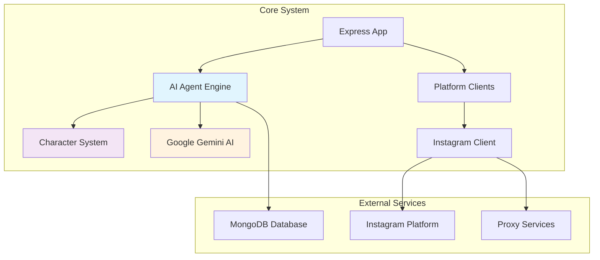

# Instagram AI Agent 🤖

**AI-Powered Social Media Automation Platform**

Instagram AI Agent is a sophisticated automation tool that combines browser automation, artificial intelligence, and character-based personalities to create engaging social media interactions. Built with TypeScript and Node.js, it provides a robust foundation for automated Instagram engagement with plans for multi-platform support.

## 🚀 Quick Start

Get up and running in minutes:

1. **[Installation](getting-started/installation.md)** - Set up your development environment
2. **[Configuration](getting-started/configuration.md)** - Configure credentials and settings  
3. **[Quick Start Guide](getting-started/quick-start.md)** - Run your first automation

## 🏗️ Architecture Overview

## ✨ Key Features

### 🎭 **AI-Powered Content Generation**
- **Character-Based Personalities**: Elon Musk, ArcanEdge, and custom characters
- **Context-Aware Comments**: Generates relevant, engaging responses to Instagram posts
- **Viral Rate Optimization**: AI evaluates content potential for maximum engagement

### 🔧 **Advanced Automation**
- **Stealth Browser Automation**: Puppeteer with anti-detection plugins
- **Cookie Session Management**: Persistent login sessions across restarts
- **Proxy Support**: Avoid rate limits and manage multiple accounts
- **Smart Interaction Timing**: Randomized delays mimic human behavior

### 📚 **Flexible Training System**
Train your AI agent with multiple content types:
- **YouTube Videos** - Extract transcripts and speaking patterns
- **Audio Files** - Process tone and conversational style  
- **Documents** - PDF, DOC, DOCX, TXT file analysis
- **Website Content** - Scrape and analyze web content

## 📖 Documentation Sections

### Instagram Agent Development
- **[Developer Introduction](instagram-agent/developer-introduction.md)** - Complete developer guide and codebase map for the Instagram agent
- **[How Scheduling and Delays Work](instagram-agent/scheduling-delays.md)** - Understanding the timing mechanisms that make the agent safe and human-like
- **[Content Generation & Decision Making](instagram-agent/content-generation.md)** - How the agent decides what content to create, write, and post

### For New Developers
- **[Quick Start](getting-started/quick-start.md)** - Get running fast
- **[Installation Guide](getting-started/installation.md)** - Detailed setup instructions
- **[Configuration](getting-started/configuration.md)** - Environment and credentials setup

### For Understanding the System
- **[Architecture Overview](architecture/overview.md)** - High-level system design
- **[AI Agent System](architecture/ai-agent.md)** - How the AI engine works
- **[Platform Clients](architecture/clients.md)** - Social media integration layer

### For Contributors
- **[Development Setup](development/setup.md)** - Development environment configuration
- **[Code Structure](development/code-structure.md)** - Codebase organization and patterns
- **[Adding Features](development/adding-features.md)** - Extending the platform

### Reference Materials
- **[Core Functions](api/core.md)** - Main API functions and usage
- **[Schema Reference](api/schemas.md)** - AI response schemas and data models

### User Guides  
- **[Instagram Bot Guide](guides/instagram-bot.md)** - Complete Instagram automation setup
- **[Training the AI](guides/training-ai.md)** - Customize AI behavior with training data
- **[Custom Characters](guides/custom-characters.md)** - Create and configure AI personalities

## 🛠️ Technology Stack

| Component | Technology | Purpose |
|-----------|------------|---------|
| **Runtime** | Node.js + TypeScript | Main application runtime |
| **AI Engine** | Google Gemini 2.0 Flash | Content generation and analysis |
| **Browser Automation** | Puppeteer + Stealth plugins | Instagram interaction |
| **Web Framework** | Express.js | API server and middleware |
| **Database** | MongoDB + Mongoose | Data persistence and session management |
| **Logging** | Winston | Comprehensive activity logging |
| **Task Scheduling** | Node-cron | Automated execution timing |

## 🔐 Security Features

- **Anti-Detection**: Stealth plugins and user agent rotation
- **Rate Limiting**: Built-in delays and interaction limits  
- **Secure Credential Management**: Environment variable configuration
- **Session Persistence**: Encrypted cookie storage
- **Proxy Integration**: IP rotation and geographic distribution

## 🚦 Getting Started

Choose your path:

=== "Quick Demo"
    Want to see it in action immediately?
    
    👉 **[Quick Start Guide](getting-started/quick-start.md)**

=== "Full Setup"
    Setting up for development or production?
    
    👉 **[Installation Guide](getting-started/installation.md)**

=== "Understanding the Code"
    Want to understand how it works?
    
    👉 **[Architecture Overview](architecture/overview.md)**

## 🤝 Contributing

We welcome contributions! Check out our:

- **[Development Setup](development/setup.md)** for getting your dev environment ready
- **[Code Structure](development/code-structure.md)** for understanding our patterns
- **[Adding Features](development/adding-features.md)** for extending the platform

## 📞 Support

Need help? Check these resources:

- 📖 **Documentation**: You're here! Use the navigation above
- 🐛 **Issues**: Report bugs and request features on GitHub
- 💬 **Discussions**: Join the community for questions and ideas

---

*Ready to automate your social media with AI?* **[Let's get started! →](getting-started/quick-start.md)**
