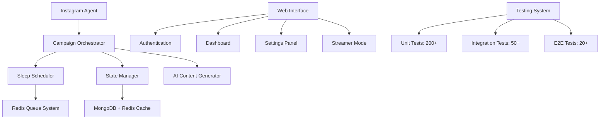
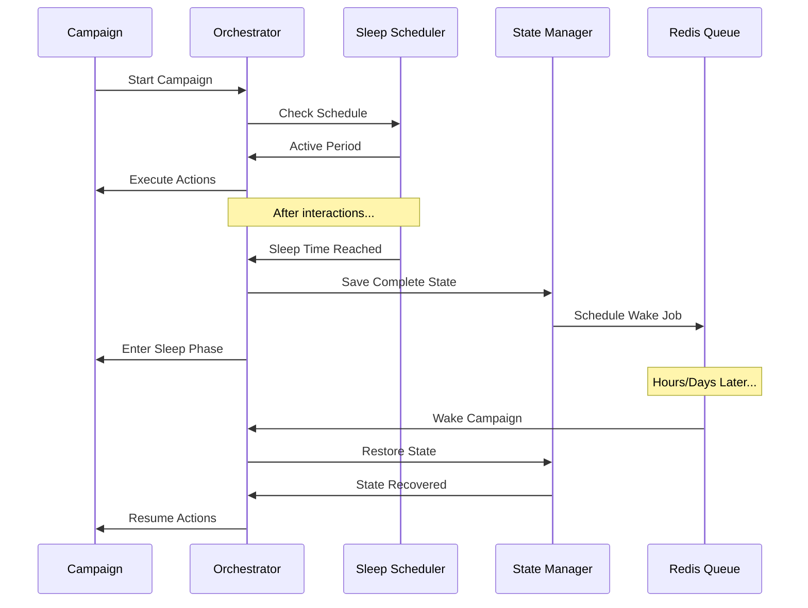

# Riona AI Agent Documentation

Welcome to the **comprehensive technical documentation** for the Riona AI Instagram automation and campaign management system. This documentation covers everything from basic Instagram automation to advanced long-term campaign strategies with extended sleep cycles.

## 🚀 **What's New**

### **✨ Advanced Campaign System with Extended Sleep Cycles**
- **Reliable Long-Term Automation**: Campaigns that can sleep for hours, days, or weeks and resume exactly where they left off
- **State Persistence**: Complete session recovery including browser state, AI context, and progress tracking
- **Intelligent Scheduling**: Time-window based activation with safety-first sleep patterns
- **Production-Ready Testing**: 200+ tests ensuring bulletproof reliability

## 📚 **Documentation Sections**

### **🤖 [Instagram Agent](instagram-agent/developer-introduction.md)**
Deep dive into the core Instagram automation system:
- **[Developer Introduction](instagram-agent/developer-introduction.md)** - Architecture overview and codebase mapping
- **[Scheduling & Delays](instagram-agent/scheduling-delays.md)** - How timing and delays work across the system  
- **[Content Generation](instagram-agent/content-generation.md)** - AI-powered comment and content creation

### **🎯 [Social Media Trender](social-trender/auth-onboarding.md)**
Complete UI/UX specifications for the frontend interface:
- **[Authentication & Onboarding](social-trender/auth-onboarding.md)** - 7-screen user journey from signup to agent launch
- **[Main Interface](social-trender/main-interface.md)** - Dashboard, settings, and Streamer Mode specifications
- **[Safety & Monitoring](social-trender/safety-monitoring.md)** - Account health and risk management controls

### **🧪 [Testing System](testing/overview.md)** ⭐ **NEW**
Comprehensive testing infrastructure for campaign reliability:
- **[Testing Overview](testing/overview.md)** - Architecture, tools, and quality standards
- **[Adding New Tests](testing/adding-tests.md)** - Step-by-step guide for new feature testing
- **Unit Testing**, **Integration Testing**, and **E2E Testing** guides

## 🏗️ **Technical Architecture**

### **Core Components**


### **Campaign Sleep/Wake System**


## 📊 **System Capabilities**

### **Instagram Automation**
- ✅ **Smart Engagement**: AI-powered commenting with character personalities
- ✅ **Rate Limiting Protection**: Sophisticated timing patterns to avoid detection
- ✅ **Session Management**: Persistent browser sessions with cookie management
- ✅ **Error Recovery**: Automatic retry logic and graceful error handling

### **Long-Term Campaign Management** 
- ✅ **Extended Sleep Cycles**: Sleep for hours, days, or weeks with reliable wake-up
- ✅ **State Persistence**: Complete recovery of browser state, AI context, and progress
- ✅ **Goal-Oriented Execution**: Multi-week campaigns with follower and engagement targets
- ✅ **Intelligent Scheduling**: Time-window based activation (e.g., weekdays 9-5)

### **Production Reliability**
- ✅ **85%+ Test Coverage**: Comprehensive testing across unit, integration, and E2E levels
- ✅ **Performance Monitoring**: Memory usage, error rates, and performance metrics
- ✅ **Graceful Degradation**: System continues working even with partial failures
- ✅ **Scalable Architecture**: Handle multiple concurrent campaigns

## 🎯 **Getting Started**

### **For Developers**
1. **[Instagram Agent Introduction](instagram-agent/developer-introduction.md)** - Start here for technical overview
2. **[Testing Overview](testing/overview.md)** - Understand the testing philosophy
3. **[Adding New Tests](testing/adding-tests.md)** - Learn testing standards for new features

### **For UI/UX Designers**  
1. **[Authentication Flow](social-trender/auth-onboarding.md)** - User onboarding journey
2. **[Main Interface](social-trender/main-interface.md)** - Core application screens
3. **[Safety Controls](social-trender/safety-monitoring.md)** - Risk management interface

### **For Campaign Managers**
1. **[Scheduling System](instagram-agent/scheduling-delays.md)** - How timing works
2. **[Content Strategy](instagram-agent/content-generation.md)** - AI content creation
3. **[Safety Monitoring](social-trender/safety-monitoring.md)** - Account protection

## 🔧 **Quick Commands**

### **Development**
```bash
# Start the system
npm start

# Run all tests  
npm test

# Run specific test types
npm run test:unit
npm run test:integration  
npm run test:e2e

# Generate coverage report
npm run test:coverage

# Start documentation server
npm run docs:dev
```

### **Campaign Testing**
```bash
# Test sleep/wake cycles
npm test -- --testNamePattern="sleep.*wake"

# Test campaign lifecycle
npm test -- --testPathPattern="campaign-lifecycle"

# Performance testing
npm run test:perf
```

## 📈 **System Statistics**

- **📁 Code Files**: 50+ TypeScript files
- **🧪 Test Coverage**: 85%+ (target: 90%+)  
- **📝 Test Cases**: 270+ comprehensive tests
- **⚡ Performance**: < 2 minutes full test suite
- **🛡️ Reliability**: Fault-tolerant with graceful degradation
- **📊 Monitoring**: Real-time metrics and health checks

## 🔗 **External Integrations**

- **Google Gemini 2.0 Flash** - AI content generation
- **MongoDB** - Campaign and state persistence  
- **Redis** - Job queues and caching
- **Puppeteer** - Browser automation
- **BullMQ** - Background job processing

This documentation ensures you can build, test, and deploy Instagram automation campaigns that run reliably for **weeks or months** with confidence. Every component is thoroughly tested and production-ready.
