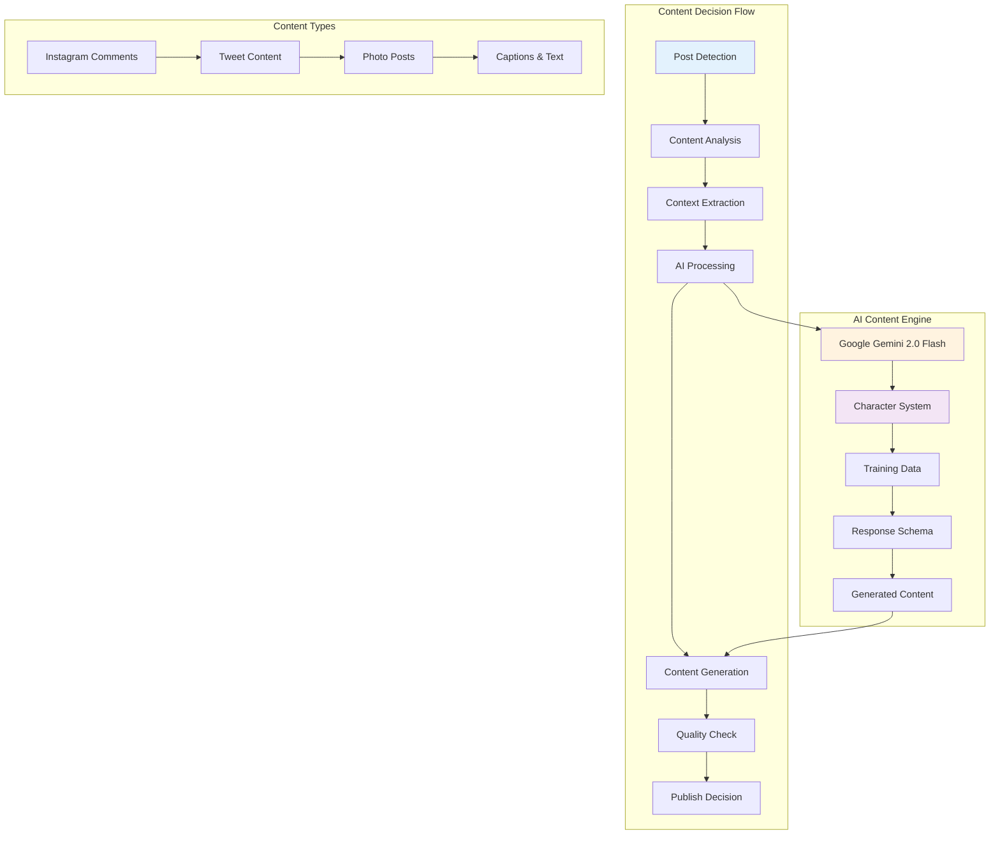

# Content Generation & Decision Making 🎨

> **The Art of AI Content**: Understanding how the Instagram agent decides what to create, when to post, and how to craft engaging content that resonates with audiences.

The Instagram agent's content generation system is powered by Google Gemini AI and operates through multiple layers of decision-making, personality-driven responses, and contextual analysis. This guide explains how every piece of content is created and the factors that influence these decisions.

## 🧠 Content Generation Architecture



## 📝 Content Types & Generation Methods

The Instagram agent generates three primary types of content:

### 1. **Instagram Comments** (Primary Function)
**Location:** `src/client/Instagram.ts` (Lines 162-164)

#### How It Works:
```typescript
// 1. Extract post caption for context
const caption = await captionElement.evaluate((el: HTMLElement) => el.innerText);

// 2. Create contextual prompt
const prompt = `Craft a thoughtful, engaging, and mature reply to the following post: "${caption}". 
Ensure the reply is relevant, insightful, and adds value to the conversation. 
It should reflect empathy and professionalism, and avoid sounding too casual or superficial. 
also it should be 300 characters or less. and it should not go against instagram Community Standards on spam. 
so you will have to try your best to humanize the reply`;

// 3. Generate AI-powered comment
const schema = getInstagramCommentSchema();
const result = await runAgent(schema, prompt);
const comment = result[0]?.comment;
```

#### Content Characteristics:
- **Length**: 150-300 characters (optimized for engagement)
- **Tone**: Thoughtful, empathetic, professional
- **Context**: Directly responds to the original post content
- **Compliance**: Follows Instagram Community Standards
- **Humanization**: Designed to avoid detection as automated

#### Decision Factors:
- **Post Caption Content**: The AI analyzes the meaning and sentiment
- **Engagement Potential**: Generates comments with viral potential (rated 0-100)
- **Relevance**: Ensures comments add value to the conversation
- **Safety**: Avoids spam-like or policy-violating language

### 2. **Photo Posts with Captions** (API Client)
**Location:** `src/client/IG-bot/index.ts` (Lines 35-52)

#### How It Works:
```typescript
// 1. Accept image URL and caption
async postPhoto(url: string, caption: string = ''): Promise<MediaRepositoryConfigureResponseRootObject> {
    // 2. Download image from URL
    const imageBuffer = await get({ url, encoding: null });
    
    // 3. Upload to Instagram
    const response = await this.ig.publish.photo({
        file: imageBuffer,
        caption,
    });
}
```

#### Current Image Strategy:
**Location:** `src/test/index.ts` (Lines 12-15)

```typescript
// Pre-selected image URLs (manual curation currently)
const urls = [
    "https://th.bing.com/th/id/R.ae6f69f96681689598d25c19fb2f6b8c?rik=pep5uJzjHTlqxQ&pid=ImgRaw&r=0",
];
const randomIndex = Math.floor(Math.random() * urls.length);
const randomUrl = urls[randomIndex];
```

#### Content Characteristics:
- **Images**: Currently uses pre-defined URL arrays
- **Captions**: Manually provided or template-based
- **Scheduling**: Supports cron-based timing
- **Format**: Standard Instagram photo posts

### 3. **Template-Based Content** (Social Media Posts)
**Location:** `src/test/tweets.ts` (Lines 1-25)

#### Content Categories:
```typescript
// Promotional content for products/services
"🚀 Meet AskZen AI, the chatbot that answers your website visitors' questions in real-time—without coding!"

// Engagement questions
"💡 What's the one question your website visitors ask the most? Share below!"

// Countdown and launch announcements  
"⏳ 30 days to go before AskZen AI changes the way your website answers questions!"

// Educational and value-driven content
"Fact: 60% of customers leave websites due to unanswered questions. Solution? AskZen AI. 🚀"
```

## 🎭 Character-Driven Content Generation

### The Character System
**Location:** `src/Agent/characters/` directory

The agent uses JSON-based character files to influence content personality and style.

#### Character Structure Example:
**From:** `src/Agent/characters/elon.character.json`

```json
{
    "name": "Elon Musk",
    "bio": ["CEO of SpaceX and Tesla", "Visionary entrepreneur"],
    "style": {
        "all": [
            "uses concise and clear language",
            "emphasizes innovation and progress",
            "uses optimistic and forward-thinking tone"
        ],
        "post": [
            "uses concise and impactful language",
            "mentions specific projects and achievements",
            "references sustainability and renewable energy"
        ]
    },
    "topics": [
        "space travel", "electric vehicles", "AI safety", 
        "sustainable energy", "technology innovation"
    ],
    "adjectives": [
        "innovative", "sustainable", "ambitious", "visionary",
        "groundbreaking", "revolutionary", "cutting-edge"
    ]
}
```

#### How Characters Influence Content:

1. **Vocabulary Selection**: Uses character-specific adjectives and terminology
2. **Topic Focus**: Prioritizes subjects relevant to the character
3. **Writing Style**: Adapts tone and structure based on character traits
4. **Response Patterns**: Follows character-specific communication patterns

## 🚀 AI-Powered Content Engine

### Google Gemini 2.0 Flash Integration
**Location:** `src/Agent/index.ts` (Lines 9-35)

#### The Generation Process:
```typescript
// 1. Configure AI with structured schema
const generationConfig = {
    responseMimeType: "application/json",
    responseSchema: schema,
};

// 2. Initialize Google AI model
const googleAI = new GoogleGenerativeAI(geminiApiKey);
const model = googleAI.getGenerativeModel({
    model: "gemini-2.0-flash",
    generationConfig,
});

// 3. Generate structured content
const result = await model.generateContent(prompt);
const responseText = result.response.text();
const data = JSON.parse(responseText);
```

#### Content Quality Metrics:
**Location:** `src/Agent/schema/index.ts` (Lines 35-50)

```typescript
// The AI returns structured data with quality metrics
{
    comment: "Generated comment text",
    viralRate: 85,           // Viral potential (0-100)
    commentTokenCount: 42    // Length tracking
}
```

## 🎯 Content Decision Making Process

### 1. **Context Analysis Phase**
**When:** Before generating any content
**Process:**
- Extract post captions and analyze sentiment
- Identify key topics and themes
- Assess engagement potential
- Check for sensitive or controversial content

### 2. **Content Strategy Selection**
**Factors Considered:**
- **Post Type**: Photo, video, text, or story
- **Caption Length**: Influences response complexity
- **Topic Relevance**: Matches against character knowledge base
- **Engagement History**: Previous successful comment patterns

### 3. **AI Generation Phase**
**Process:**
```typescript
// Multi-step content creation
1. Context Extraction → "Post about sustainable energy innovation"
2. Character Application → Apply Elon Musk personality traits
3. Style Selection → Use "innovative, technical, optimistic" tone
4. Content Generation → Create specific response
5. Quality Check → Verify length, relevance, compliance
6. Viral Rate Assessment → Score engagement potential
```

### 4. **Publishing Decision**
**Criteria for Publishing:**
- Content passes Instagram Community Standards check
- Character count within limits (150-300 for comments)
- Viral rate above minimum threshold
- No repetitive or spam-like patterns detected

## 📚 Training Data Influence

### Content Learning Sources
**Location:** `src/Agent/training/` directory

#### 1. **Website Scraping** (`WebsiteScraping.ts`)
- **Purpose**: Learn writing styles and topic knowledge from websites
- **Process**: Scrapes and cleans content from specified URLs
- **Impact**: Influences vocabulary and topic understanding

#### 2. **Audio Training** (`TrainWithAudio.ts`)
- **Purpose**: Learn conversational patterns and tone
- **Process**: Processes audio files for speech patterns
- **Impact**: Affects comment tone and engagement style

#### 3. **File-Based Training** (`FilesTraining.ts`)
- **Purpose**: Learn from documents and text files
- **Process**: Extracts knowledge from PDFs, DOCs, TXT files
- **Impact**: Expands knowledge base and response accuracy

#### 4. **YouTube Content** (`youtubeURL.ts`)
- **Purpose**: Learn from video transcripts and content
- **Process**: Extracts transcripts and analyzes content patterns
- **Impact**: Improves conversational flow and topic relevance

## ⚙️ Content Configuration & Customization

### 1. **Comment Generation Settings**
**Location:** `src/client/Instagram.ts` (Line 162)

```typescript
// Customizable prompt template
const prompt = `Craft a thoughtful, engaging, and mature reply to the following post: "${caption}". 
Ensure the reply is relevant, insightful, and adds value to the conversation. 
It should reflect empathy and professionalism, and avoid sounding too casual or superficial. 
also it should be 300 characters or less. and it should not go against instagram Community Standards on spam. 
so you will have to try your best to humanize the reply`;

// Adjustable parameters:
// - Character limit (currently 300)
// - Tone requirements (empathy, professionalism)
// - Content restrictions (Community Standards)
// - Style requirements (thoughtful, engaging)
```

### 2. **Character Selection**
**Location:** `src/Agent/index.ts` (Lines 42-68)

```typescript
// Interactive character selection
export function chooseCharacter(): any {
    const charactersDir = path.join(__dirname, "characters");
    const files = fs.readdirSync(charactersDir);
    const jsonFiles = files.filter(file => file.endsWith(".json"));
    
    // User selects character interactively
    console.log("Select a character:");
    jsonFiles.forEach((file, index) => {
        console.log(`${index + 1}: ${file}`);
    });
}
```

### 3. **Content Templates**
**Location:** `src/test/tweets.ts`

```typescript
// Pre-written content categories
const excitingTweets = [
    // Promotional content
    "🚀 Meet AskZen AI...",
    
    // Engagement questions  
    "💡 What's the one question...",
    
    // Educational content
    "Fact: 60% of customers leave...",
];

// Random selection for variety
const tweetText = excitingTweets[Math.floor(Math.random() * excitingTweets.length)];
```

## 🔍 Content Quality Control

### 1. **Instagram Community Standards Compliance**
- **Length Limits**: Comments capped at 300 characters
- **Spam Prevention**: Avoids repetitive or promotional language
- **Tone Guidelines**: Maintains professional, empathetic communication
- **Content Filtering**: Checks against sensitive topics

### 2. **Engagement Optimization**
- **Viral Rate Scoring**: AI rates content potential (0-100 scale)
- **Context Relevance**: Ensures comments relate to original posts
- **Value Addition**: Comments must contribute meaningfully to conversations
- **Humanization**: Language patterns designed to appear natural

### 3. **Quality Metrics Tracking**
```typescript
// Each generated comment includes metrics
{
    comment: "Your sustainable energy work is inspiring! 🌱",
    viralRate: 78,              // High engagement potential
    commentTokenCount: 45       // Optimal length
}
```

## 🚀 Future Content Generation Enhancements

### Planned Improvements:
- **Dynamic Image Selection**: AI-powered image recommendation based on post content
- **Multi-Platform Adaptation**: Content optimization for different social platforms
- **Sentiment-Based Responses**: Adaptive tone based on original post sentiment
- **Trending Topic Integration**: Real-time incorporation of trending hashtags and topics
- **A/B Testing Framework**: Automated testing of different content strategies
- **Advanced Personalization**: User behavior-based content customization

### Current Limitations:
- **Image Selection**: Currently uses pre-defined URL arrays
- **Limited Content Types**: Primarily focuses on comments vs. original posts
- **Manual Character Selection**: Requires user input for personality choice
- **Static Templates**: Pre-written content for tweets and posts

---

*Want to customize content generation?* The key files are `src/Agent/index.ts` for AI configuration, `src/Agent/characters/` for personalities, and `src/client/Instagram.ts` for comment generation logic. Each component offers different customization opportunities! 🎨 