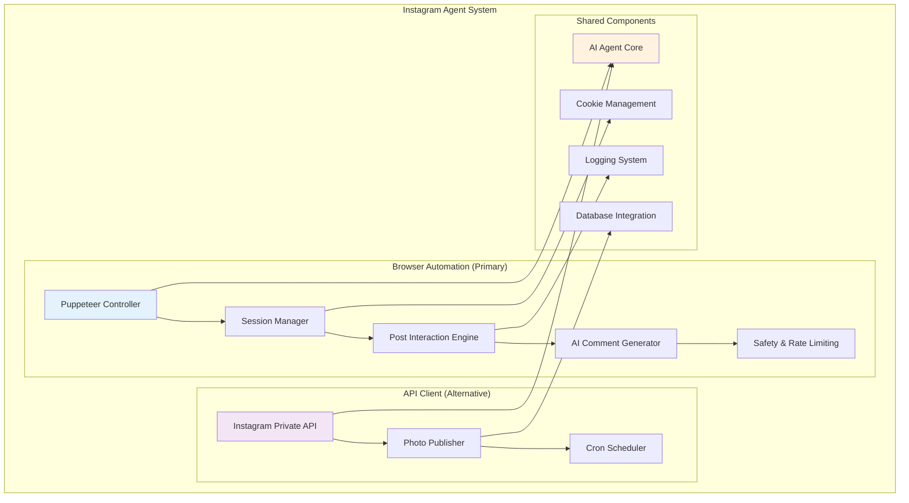
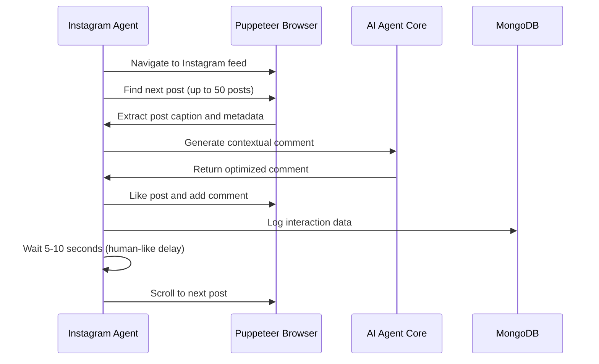

# Instagram Agent - Developer Introduction 🤖

> **Development Guide**: This documentation section provides comprehensive developer guides and technical documentation specifically for the Instagram agent component of the Riona AI system.

Welcome to the Instagram Agent developer documentation! This guide will give you a complete map of the Instagram automation system, its architecture, capabilities, and where to find everything in the codebase.

!!! tip "Explore While You Read"
    💡 **This documentation works best when you have the codebase open alongside it.** We'll reference specific files and directories throughout - feel free to explore them as you read!

## 🎯 What is the Instagram Agent?

The Instagram Agent is a sophisticated **AI-powered automation system** that intelligently interacts with Instagram content. It's designed to:

- **Like posts** automatically based on intelligent content analysis
- **Generate thoughtful comments** using Google Gemini AI 
- **Maintain authentic engagement** while avoiding spam detection
- **Operate continuously** with human-like interaction patterns
- **Manage sessions** persistently across restarts

### Core Philosophy
The agent follows a **"Quality over Quantity"** approach - it focuses on creating meaningful interactions rather than mass engagement, using AI to generate contextually relevant and engaging comments.

## 🏗️ Architecture Overview

The Instagram Agent consists of **two distinct implementations** that serve different use cases:



## 📁 Codebase Map - Where to Find Everything

### 🚀 **Primary Implementation: Browser Automation**
**Location:** `src/client/Instagram.ts` (205 lines)

This is the **main production system** that powers the Instagram agent. Here's what you'll find:

#### 1. Authentication & Session Management (Lines 23-97)
```typescript
// 1. Cookie-based authentication system
const checkCookies = await Instagram_cookiesExist();

// 2. Fallback to credential login if cookies expire  
await loginWithCredentials(page, browser);

// 3. Session persistence across restarts
await saveCookies("./cookies/Instagramcookies.json", cookies);
```

#### 2. Core Interaction Loop (Lines 98-201)
```typescript
// 1. Continuous post interaction
while (true) {
    await interactWithPosts(page);
    await delay(30000); // 30-second intervals
    await page.reload({ waitUntil: "networkidle2" });
}

// 2. Smart post processing (up to 50 posts per iteration)
// 3. AI-powered comment generation
// 4. Human-like interaction timing
```

#### 3. AI Integration Points (Lines 160-170)
```typescript
// AI comment generation using structured prompts
const prompt = `Craft a thoughtful, engaging, and mature reply...`;
const schema = getInstagramCommentSchema();
const result = await runAgent(schema, prompt);
```

### 🔧 **Alternative Implementation: API Client**
**Location:** `src/client/IG-bot/index.ts` (106 lines)

This provides a **direct API approach** for specific use cases:

#### Key Features:
- **Direct photo publishing** from URLs
- **Scheduled posting** via cron jobs  
- **Programmatic content management**
- **Error handling and retry logic**

```typescript
// Example usage from the codebase:
const client = new InstagramClient(username, password);
await client.login();
await client.postPhoto(url, caption);
await client.schedulePost(url, caption, '0 9 * * *'); // Daily at 9 AM
```

### 🧠 **AI Integration Layer**
**Location:** `src/Agent/` directory

#### Core AI Files:
- **`src/Agent/index.ts`** (92 lines) - Main AI agent controller
- **`src/Agent/schema/index.ts`** (82 lines) - Comment generation schemas
- **`src/Agent/characters/`** - AI personality definitions (JSON files)

#### AI Comment Schema Structure:
```typescript
// Located in src/Agent/schema/index.ts
export interface InstagramCommentSchema {
    description: string;
    type: SchemaType;
    items: {
        // 1. Comment content (150-250 characters)
        comment: { type: SchemaType.STRING };
        // 2. Viral potential rating (0-100)
        viralRate: { type: SchemaType.NUMBER };
        // 3. Token count tracking
        commentTokenCount: { type: SchemaType.NUMBER };
    };
}
```

### 🔐 **Security & Configuration**
**Location:** `src/secret/index.ts` and `src/utils/index.ts`

#### Environment Variables:
```bash
# Required in your .env file
IGusername=your_instagram_username  
IGpassword=your_instagram_password
```

#### Cookie Management:
```typescript
// Located in src/utils/index.ts
export async function Instagram_cookiesExist(): Promise<boolean>
```

### 🚀 **Application Integration**
**Location:** `src/app.ts` (54 lines)

See how the Instagram agent integrates with the main application:

```typescript
// Main execution loop (lines 30-43)
const runAgents = async () => {
    while (true) {
        logger.info("Starting Instagram agent iteration...");
        await runInstagram(); // This calls src/client/Instagram.ts
        logger.info("Instagram agent iteration finished.");
        
        // Future: Twitter and GitHub agents will be added here
        await new Promise(resolve => setTimeout(resolve, 30000));
    }
};
```

## 🔄 Development Flow - How Everything Works Together

### 1. **Application Startup** (`src/app.ts`)
- Connects to MongoDB database
- Sets up Express middleware
- Initializes error handlers and logging
- Starts the continuous agent loop

### 2. **Instagram Agent Execution** (`src/client/Instagram.ts`)
- Launches Puppeteer browser with stealth plugins
- Checks for existing authentication cookies
- Logs in via cookies or credentials if needed
- Enters the main interaction loop

### 3. **Post Interaction Cycle** (Continuous Loop)


### 4. **AI Comment Generation** (`src/Agent/index.ts`)
- Receives post content and context
- Uses Google Gemini AI with structured schema
- Applies character personality (from `src/Agent/characters/`)
- Returns comment with viral rate and token count

### 5. **Safety & Rate Limiting**
- Random delays between actions (5-10 seconds)
- Maximum 50 posts per iteration
- 30-second breaks between iterations
- Proxy support for IP protection
- Stealth plugins to avoid detection

## 🛠️ Key Technologies & Dependencies

| Component | Technology | File Location | Purpose |
|-----------|------------|---------------|---------|
| **Browser Automation** | Puppeteer + Stealth | `src/client/Instagram.ts` | Main interaction engine |
| **AI Integration** | Google Gemini 2.0 Flash | `src/Agent/index.ts` | Comment generation |
| **API Alternative** | Instagram Private API | `src/client/IG-bot/index.ts` | Direct posting |
| **Database** | MongoDB + Mongoose | `src/Agent/schema/index.ts` | Data persistence |
| **Scheduling** | Node-cron | `src/client/IG-bot/index.ts` | Automated posting |
| **Logging** | Winston | `src/config/logger.ts` | Activity tracking |
| **Security** | Proxy-chain | `src/client/Instagram.ts` | IP protection |

## 🎯 Development Starting Points

### For New Contributors:
1. **Start Here:** `src/client/Instagram.ts` - Main agent implementation
2. **Understand AI:** `src/Agent/index.ts` - AI integration layer  
3. **Check Schemas:** `src/Agent/schema/index.ts` - Data structures
4. **See Integration:** `src/app.ts` - How it all connects

### For Feature Development:
- **Adding new interactions:** Extend `interactWithPosts()` in `Instagram.ts`
- **Modifying AI behavior:** Update schemas in `src/Agent/schema/index.ts`
- **Adding personalities:** Create new JSON files in `src/Agent/characters/`
- **Improving safety:** Enhance delay and detection logic in `Instagram.ts`

### For Testing & Debugging:
- **Logs:** Check `logs/` directory for detailed execution logs
- **Screenshots:** The agent saves `logged_in.png` for verification
- **Cookies:** Inspect `cookies/Instagramcookies.json` for session data
- **Database:** Monitor MongoDB for interaction tracking

## 🚀 Next Steps

Ready to dive deeper? Check out:

- **[How Scheduling and Delays Work](scheduling-delays.md)** - Understanding the timing mechanisms that make the agent safe and human-like
- **[Content Generation & Decision Making](content-generation.md)** - How the agent decides what content to create, write, and post

!!! note "Keep Exploring"
    💡 **Remember**: This documentation is your map, but the codebase is your territory. Keep both open as you develop - the code often contains implementation details and edge cases that complement this documentation perfectly!

---

*Ready to understand how timing works?* **[Learn about scheduling and delays →](scheduling-delays.md)** 