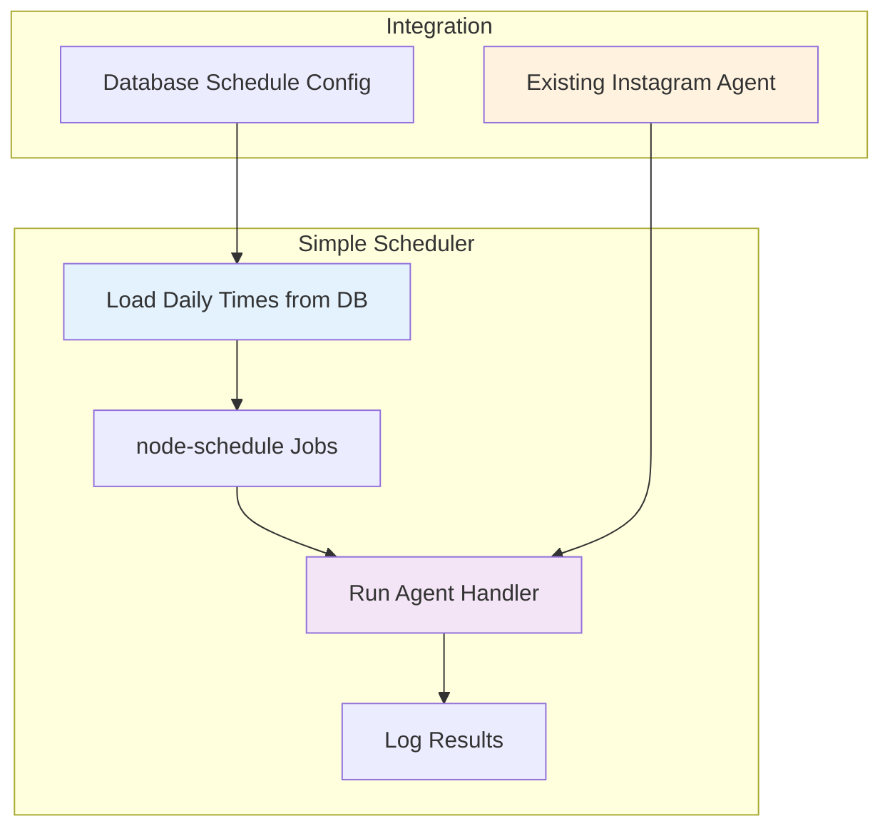

# Simple Daily Scheduling System 🕐

> **Minimal Instagram Agent Scheduling**: A simple system where the Instagram agent runs at preset daily times without complex state management or sleep/wake cycles.

This system replaces complex scheduling infrastructure with a straightforward approach: load times from database, schedule jobs, done.

## 🏗️ Simple Architecture



## 📋 Implementation Guide

### Step 1: Install Dependencies

```bash
npm install node-schedule
```

### Step 2: Database Schema

Create a simple table for daily schedules:

```sql
-- Daily schedule times (simple approach)
CREATE TABLE daily_schedules (
  id SERIAL PRIMARY KEY,
  time_hour INTEGER NOT NULL,    -- 0-23
  time_minute INTEGER NOT NULL,  -- 0-59
  is_active BOOLEAN DEFAULT true,
  created_at TIMESTAMP DEFAULT NOW()
);

-- Example data
INSERT INTO daily_schedules (time_hour, time_minute) VALUES 
(9, 0),   -- 9:00 AM
(14, 0),  -- 2:00 PM  
(18, 0);  -- 6:00 PM
```

### Step 3: Core Scheduler Implementation

**File:** `src/scheduling/DailyScheduler.ts`

```typescript
import * as schedule from 'node-schedule';
import { runAgent } from '../Agent';
import { InstagramCommentSchema } from '../Agent/schema';
import logger from '../config/logger';

interface DailyScheduleTime {
  id: number;
  time_hour: number;
  time_minute: number;
  is_active: boolean;
}

export class DailyScheduler {
  private jobs: schedule.Job[] = [];

  /**
   * 1. Load daily schedule times from database
   * Returns array of active schedule times
   */
  async loadSchedulesFromDatabase(): Promise<DailyScheduleTime[]> {
    // Replace with your actual database query
    // This example assumes you have a database connection
    const query = `
      SELECT id, time_hour, time_minute, is_active 
      FROM daily_schedules 
      WHERE is_active = true
    `;
    
    // Example return - replace with actual DB call
    return [
      { id: 1, time_hour: 9, time_minute: 0, is_active: true },
      { id: 2, time_hour: 14, time_minute: 0, is_active: true },
      { id: 3, time_hour: 18, time_minute: 0, is_active: true }
    ];
  }

  /**
   * 2. Execute Instagram agent (your existing logic)
   * This is called automatically by node-schedule at scheduled times
   */
  async executeAgent(): Promise<void> {
    try {
      logger.info('🤖 Starting scheduled Instagram agent execution');
      
      // Use your existing agent implementation
      const schema = InstagramCommentSchema;
      const prompt = "Execute daily Instagram engagement routine";
      
      const result = await runAgent(schema, prompt);
      
      logger.info('✅ Scheduled agent execution completed successfully', {
        result: result,
        executedAt: new Date()
      });
      
    } catch (error) {
      logger.error('❌ Scheduled agent execution failed', {
        error: error.message,
        stack: error.stack,
        executedAt: new Date()
      });
    }
  }

  /**
   * 3. Set up all daily scheduling jobs
   * Call this once when your app starts
   */
  async setupDailyScheduling(): Promise<void> {
    try {
      // Clear any existing jobs
      this.clearAllJobs();
      
      // Load schedule times from database
      const schedules = await this.loadSchedulesFromDatabase();
      
      if (schedules.length === 0) {
        logger.warn('⚠️ No active daily schedules found in database');
        return;
      }

      // Create node-schedule jobs for each time
      schedules.forEach(({ id, time_hour, time_minute }) => {
        // Cron format: minute hour * * * (every day at specified time)
        const cronPattern = `${time_minute} ${time_hour} * * *`;
        
        const job = schedule.scheduleJob(cronPattern, () => {
          this.executeAgent();
        });
        
        if (job) {
          this.jobs.push(job);
          logger.info(`📅 Scheduled daily agent run`, {
            id,
            time: `${time_hour.toString().padStart(2, '0')}:${time_minute.toString().padStart(2, '0')}`,
            cronPattern
          });
        } else {
          logger.error(`❌ Failed to schedule job for ${time_hour}:${time_minute}`);
        }
      });
      
      logger.info(`🎯 Total scheduled jobs created: ${this.jobs.length}`);
      
    } catch (error) {
      logger.error('💥 Failed to setup daily scheduling', {
        error: error.message,
        stack: error.stack
      });
      throw error;
    }
  }

  /**
   * 4. Update schedules when database changes
   * Call this when user updates their schedule preferences
   */
  async refreshSchedules(): Promise<void> {
    logger.info('🔄 Refreshing daily schedules from database');
    await this.setupDailyScheduling();
  }

  /**
   * 5. Clear all scheduled jobs
   * Useful for cleanup or before setting new schedules
   */
  clearAllJobs(): void {
    this.jobs.forEach(job => {
      if (job) {
        job.cancel();
      }
    });
    this.jobs = [];
    logger.info('🧹 Cleared all scheduled jobs');
  }

  /**
   * 6. Get info about currently scheduled jobs
   * Useful for debugging or status checks
   */
  getScheduleInfo(): Array<{ nextRun: Date | null, pattern: string }> {
    return this.jobs.map(job => ({
      nextRun: job.nextInvocation(),
      pattern: job.name || 'unknown'
    }));
  }
}
```

### Step 4: Integration with Your App

**File:** `src/app.ts` (modify your existing startup)

```typescript
import { DailyScheduler } from './scheduling/DailyScheduler';
import logger from './config/logger';

// Global scheduler instance
let dailyScheduler: DailyScheduler;

async function startApplication() {
  try {
    // Initialize daily scheduler
    dailyScheduler = new DailyScheduler();
    await dailyScheduler.setupDailyScheduling();
    
    logger.info('✅ Application started with daily scheduling enabled');
    
    // Your existing app initialization code...
    
  } catch (error) {
    logger.error('💥 Failed to start application', error);
    process.exit(1);
  }
}

// Graceful shutdown
process.on('SIGINT', () => {
  logger.info('🛑 Received shutdown signal');
  
  if (dailyScheduler) {
    dailyScheduler.clearAllJobs();
  }
  
  process.exit(0);
});

// Export for API endpoints (optional)
export { dailyScheduler };

startApplication();
```

### Step 5: API Endpoints (Optional)

**File:** `src/api/schedule.ts`

```typescript
import { Request, Response } from 'express';
import { dailyScheduler } from '../app';
import logger from '../config/logger';

/**
 * GET /api/schedule/status
 * Get current schedule status
 */
export async function getScheduleStatus(req: Request, res: Response) {
  try {
    const scheduleInfo = dailyScheduler.getScheduleInfo();
    
    res.json({
      success: true,
      activeJobs: scheduleInfo.length,
      nextRuns: scheduleInfo
    });
  } catch (error) {
    logger.error('Failed to get schedule status', error);
    res.status(500).json({ success: false, error: error.message });
  }
}

/**
 * POST /api/schedule/refresh
 * Refresh schedules from database
 */
export async function refreshSchedules(req: Request, res: Response) {
  try {
    await dailyScheduler.refreshSchedules();
    
    res.json({
      success: true,
      message: 'Schedules refreshed successfully'
    });
  } catch (error) {
    logger.error('Failed to refresh schedules', error);
    res.status(500).json({ success: false, error: error.message });
  }
}

/**
 * POST /api/schedule/test
 * Manually trigger agent execution (for testing)
 */
export async function testAgentExecution(req: Request, res: Response) {
  try {
    await dailyScheduler.executeAgent();
    
    res.json({
      success: true,
      message: 'Agent execution completed'
    });
  } catch (error) {
    logger.error('Failed to execute agent', error);
    res.status(500).json({ success: false, error: error.message });
  }
}
```

## 🧪 Testing Guide

### What to Test in Isolation

#### 1. Schedule Loading Tests
**File:** `src/scheduling/__tests__/DailyScheduler.test.ts`

```typescript
import { DailyScheduler } from '../DailyScheduler';

describe('DailyScheduler', () => {
  let scheduler: DailyScheduler;

  beforeEach(() => {
    scheduler = new DailyScheduler();
  });

  afterEach(() => {
    scheduler.clearAllJobs();
  });

  describe('loadSchedulesFromDatabase', () => {
    test('should load active schedules from database', async () => {
      // Mock your database call
      const schedules = await scheduler.loadSchedulesFromDatabase();
      
      expect(schedules).toBeDefined();
      expect(Array.isArray(schedules)).toBe(true);
      
      if (schedules.length > 0) {
        expect(schedules[0]).toHaveProperty('time_hour');
        expect(schedules[0]).toHaveProperty('time_minute');
        expect(schedules[0]).toHaveProperty('is_active');
      }
    });

    test('should only return active schedules', async () => {
      const schedules = await scheduler.loadSchedulesFromDatabase();
      
      schedules.forEach(schedule => {
        expect(schedule.is_active).toBe(true);
      });
    });

    test('should handle empty schedule list', async () => {
      // Mock empty database result
      jest.spyOn(scheduler, 'loadSchedulesFromDatabase')
        .mockResolvedValueOnce([]);
      
      await scheduler.setupDailyScheduling();
      
      const info = scheduler.getScheduleInfo();
      expect(info).toHaveLength(0);
    });
  });
});
```

#### 2. Job Creation Tests

```typescript
describe('setupDailyScheduling', () => {
  test('should create correct number of jobs', async () => {
    // Mock database to return specific schedules
    jest.spyOn(scheduler, 'loadSchedulesFromDatabase')
      .mockResolvedValueOnce([
        { id: 1, time_hour: 9, time_minute: 0, is_active: true },
        { id: 2, time_hour: 17, time_minute: 30, is_active: true }
      ]);
    
    await scheduler.setupDailyScheduling();
    
    const info = scheduler.getScheduleInfo();
    expect(info).toHaveLength(2);
  });

  test('should handle invalid time values', async () => {
    jest.spyOn(scheduler, 'loadSchedulesFromDatabase')
      .mockResolvedValueOnce([
        { id: 1, time_hour: 25, time_minute: 0, is_active: true }, // Invalid hour
        { id: 2, time_hour: 9, time_minute: 70, is_active: true }   // Invalid minute
      ]);
    
    // Should not throw error, but may create fewer jobs
    await expect(scheduler.setupDailyScheduling()).resolves.not.toThrow();
  });

  test('should clear existing jobs before creating new ones', async () => {
    // Create initial jobs
    await scheduler.setupDailyScheduling();
    const initialCount = scheduler.getScheduleInfo().length;
    
    // Setup again
    await scheduler.setupDailyScheduling();
    const finalCount = scheduler.getScheduleInfo().length;
    
    // Should have same count, not double
    expect(finalCount).toBe(initialCount);
  });
});
```

#### 3. Agent Execution Tests

```typescript
describe('executeAgent', () => {
  test('should call runAgent with correct parameters', async () => {
    // Mock the runAgent function
    const mockRunAgent = jest.fn().mockResolvedValue({ success: true });
    jest.doMock('../Agent', () => ({
      runAgent: mockRunAgent
    }));

    await scheduler.executeAgent();

    expect(mockRunAgent).toHaveBeenCalledWith(
      expect.any(Object), // schema
      expect.any(String)  // prompt
    );
  });

  test('should handle agent execution errors gracefully', async () => {
    // Mock runAgent to throw error
    const mockRunAgent = jest.fn().mockRejectedValue(new Error('Agent failed'));
    jest.doMock('../Agent', () => ({
      runAgent: mockRunAgent
    }));

    // Should not throw error (should be logged instead)
    await expect(scheduler.executeAgent()).resolves.not.toThrow();
  });
});
```

### Integration Testing

#### 1. End-to-End Schedule Flow

```typescript
// src/scheduling/__tests__/integration/schedule-flow.test.ts
describe('Schedule Integration', () => {
  test('complete schedule lifecycle', async () => {
    const scheduler = new DailyScheduler();
    
    // 1. Setup scheduling
    await scheduler.setupDailyScheduling();
    
    // 2. Verify jobs were created
    const info = scheduler.getScheduleInfo();
    expect(info.length).toBeGreaterThan(0);
    
    // 3. Verify next run times are in the future
    info.forEach(job => {
      if (job.nextRun) {
        expect(job.nextRun.getTime()).toBeGreaterThan(Date.now());
      }
    });
    
    // 4. Test refresh functionality
    await scheduler.refreshSchedules();
    
    // 5. Cleanup
    scheduler.clearAllJobs();
    
    const finalInfo = scheduler.getScheduleInfo();
    expect(finalInfo).toHaveLength(0);
  });
});
```

#### 2. Database Integration Tests

```typescript
describe('Database Integration', () => {
  test('should work with real database', async () => {
    // Use test database
    const scheduler = new DailyScheduler();
    
    // Insert test data
    await insertTestSchedules([
      { time_hour: 10, time_minute: 30 },
      { time_hour: 15, time_minute: 45 }
    ]);
    
    // Load and verify
    const schedules = await scheduler.loadSchedulesFromDatabase();
    expect(schedules).toHaveLength(2);
    
    // Cleanup test data
    await cleanupTestSchedules();
  });
});
```

### When to Run Tests

#### **Unit Tests** (Fast - Run Always)
- Every commit
- Before deployment
- During development

```bash
npm test src/scheduling/__tests__/DailyScheduler.test.ts
```

#### **Integration Tests** (Slower - Run Selectively)
- Before production deployment
- Weekly in CI/CD
- When database schema changes

```bash
npm test src/scheduling/__tests__/integration/
```

#### **Manual Testing Checklist**
- [ ] Agent executes at scheduled times
- [ ] Schedules reload correctly after app restart
- [ ] Database changes reflect in active schedules
- [ ] Error handling works (agent failures don't crash scheduler)
- [ ] Logs are informative and useful

## 🚀 Quick Setup Summary

1. **Install**: `npm install node-schedule`
2. **Database**: Create `daily_schedules` table with your preferred times
3. **Code**: Copy `DailyScheduler.ts` and modify database queries for your setup
4. **Initialize**: Call `setupDailyScheduling()` in your app startup
5. **Test**: Run the test suite to verify everything works

## 🔍 Troubleshooting

**Problem**: Jobs not executing
- **Check**: Database connection and query results
- **Verify**: Times are in correct timezone
- **Debug**: Add more logging to `executeAgent()`

**Problem**: Memory growth over time
- **Solution**: Ensure job cleanup in error cases
- **Monitor**: Use `getScheduleInfo()` to check job count

**Problem**: Missed executions after restart
- **Expected**: This is normal - no persistence
- **Solution**: Jobs will resume on next scheduled time

---

*That's it!* This simple approach replaces 745 lines of complex documentation with a practical, maintainable solution. ✨