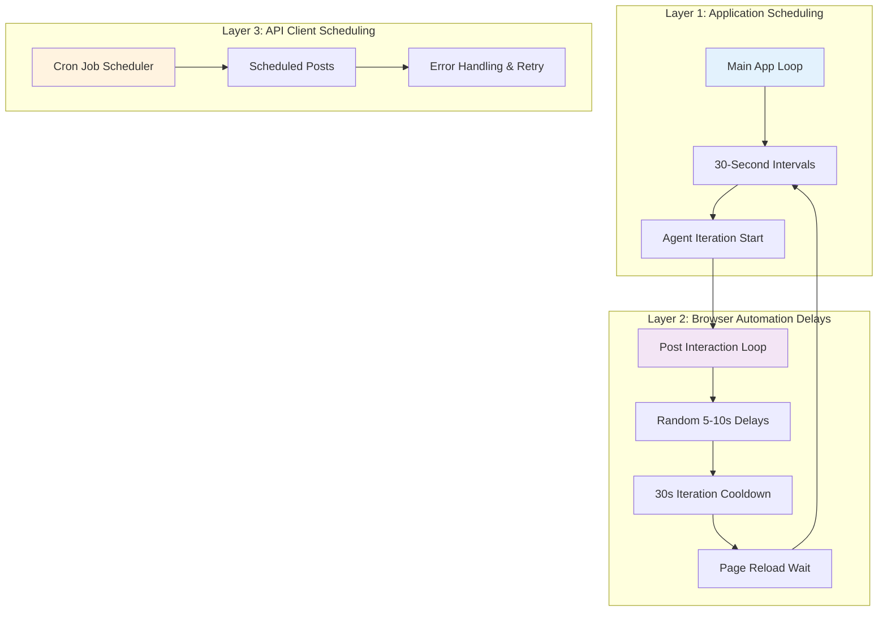

# How Scheduling and Delays Work ⏰

> **Timing is Everything**: Understanding how the Instagram agent schedules actions and manages delays is crucial for safe, effective automation that mimics human behavior.

The Instagram agent uses a sophisticated multi-layered timing system designed to avoid detection, respect platform limits, and maintain consistent operation. This guide explains every timing mechanism and where to find them in the code.

## 🏗️ Overview: The Three-Layer Timing System



The Instagram agent operates on **three distinct timing layers**:

1. **Application-level scheduling** - Controls when agent iterations start
2. **Interaction-level delays** - Mimics human behavior between actions
3. **Content scheduling** - Plans future posts and content

## 🔄 Layer 1: Application-Level Scheduling

**Location:** `src/app.ts` (Lines 30-43)

### The Master Control Loop

```typescript
const runAgents = async () => {
    while (true) {
        logger.info("Starting Instagram agent iteration...");
        await runInstagram(); // This can take 10-30 minutes
        logger.info("Instagram agent iteration finished.");

        // Wait for 30 seconds before next iteration
        await new Promise(resolve => setTimeout(resolve, 30000));
    }
};
```

#### Key Characteristics:
- **Infinite Loop**: Runs continuously until the application is stopped
- **30-Second Break**: Fixed delay between complete agent iterations
- **Error Isolation**: Each iteration is independent - errors don't stop the loop
- **Logging**: Every iteration start/end is logged for monitoring

#### Why This Design?
- **Consistent Operation**: Ensures the agent always restarts after completing a cycle
- **Resource Management**: 30-second break allows Instagram's servers to "rest"
- **Monitoring**: Clear logging helps track agent activity over time

## ⚡ Layer 2: Browser Automation Delays

**Location:** `src/client/Instagram.ts`

This layer contains the most sophisticated timing mechanisms, designed to simulate human browsing patterns.

### 2.1 Main Iteration Loop (Lines 65-73)

```typescript
// Continuously interact with posts without closing the browser
while (true) {
     await interactWithPosts(page); // Process up to 50 posts
     logger.info("Iteration complete, waiting 30 seconds before refreshing...");
     await delay(30000); // 30-second cooldown
     try {
         await page.reload({ waitUntil: "networkidle2" });
     } catch (e) {
         logger.warn("Error reloading page, continuing iteration: " + e);
     }
}
```

#### Timing Breakdown:
- **Post Processing**: 10-30 minutes (depends on available posts)
- **Cooldown Period**: Fixed 30 seconds
- **Page Reload**: Waits for network to stabilize (`networkidle2`)

### 2.2 The Delay Helper Function (Line 23)

```typescript
const delay = (ms: number) => new Promise(resolve => setTimeout(resolve, ms));
```

This simple but crucial function is used throughout the code for all timing operations.

### 2.3 Inter-Post Delays (Lines 186-189)

**This is the most important human behavior simulation:**

```typescript
// Wait before moving to the next post
const waitTime = Math.floor(Math.random() * 5000) + 5000;
console.log(`Waiting ${waitTime / 1000} seconds before moving to the next post...`);
await delay(waitTime);
```

#### Randomization Logic:
- **Base Time**: 5 seconds (5000ms)
- **Random Addition**: 0-5 additional seconds (0-5000ms)
- **Total Range**: 5-10 seconds between posts
- **Purpose**: Mimics human reading/scrolling time

### 2.4 Authentication Delays (Lines 78-88)

```typescript
// Wait for navigation after login
await page.waitForNavigation(); // Waits for Instagram to process login

// Fill out the login form with natural typing speed
await page.type('input[name="username"]', IGusername);
await page.type('input[name="password"]', IGpassword);
```

#### Key Points:
- **Navigation Waiting**: Ensures login process completes
- **Natural Typing**: Puppeteer types at human-like speed
- **Form Submission**: Waits for Instagram's response

### 2.5 Post Interaction Sequence Timing

Each post interaction follows this carefully timed sequence:

```typescript
// 1. Find and like post (immediate)
await likeButton.click();

// 2. Extract caption (immediate)  
const caption = await captionElement.evaluate(...);

// 3. Generate AI comment (2-5 seconds - external API call)
const result = await runAgent(schema, prompt);

// 4. Type and submit comment (1-2 seconds)
await commentBox.type(comment);
await postButton.click();

// 5. Random delay before next post (5-10 seconds)
const waitTime = Math.floor(Math.random() * 5000) + 5000;
await delay(waitTime);
```

## 📅 Layer 3: API Client Scheduling

**Location:** `src/client/IG-bot/index.ts` (Lines 51-64)

### Cron-Based Post Scheduling

```typescript
async schedulePost(url: string, caption: string, cronTime: string): Promise<void> {
    console.log(`Scheduling post for: ${cronTime}`);
    
    const job = new CronJob(cronTime, async () => {
        try {
            await this.postPhoto(url, caption);
        } catch (error) {
            console.error("Error during scheduled post:", error.message);
        }
    });

    job.start();
    console.log("Cron job started.");
}
```

#### Cron Expression Examples:
```bash
'0 9 * * *'     # Every day at 9:00 AM
'0 */4 * * *'   # Every 4 hours
'0 12 * * 1-5'  # Weekdays at noon
'30 8,20 * * *' # Daily at 8:30 AM and 8:30 PM
```

#### Key Features:
- **Flexible Scheduling**: Uses standard cron expressions
- **Error Handling**: Failed posts don't crash the scheduler
- **Multiple Jobs**: Can run multiple scheduled posts simultaneously
- **Persistent**: Jobs continue running until application stops

## 🎯 Timing Strategy: Human Behavior Simulation

### Why These Specific Delays?

| Delay Type | Duration | Purpose | Human Equivalent |
|------------|----------|---------|------------------|
| **Inter-post delays** | 5-10 seconds | Reading time | Time to read caption, think, scroll |
| **Iteration breaks** | 30 seconds | Session breaks | Checking other apps, brief pause |
| **Application cycles** | 30 seconds | Major breaks | Extended browsing sessions |
| **Login waits** | Variable | Network response | Typing credentials, waiting for login |

### Randomization for Detection Avoidance

```typescript
// This randomization pattern appears throughout the code:
const waitTime = Math.floor(Math.random() * 5000) + 5000;

// Breakdown:
// Math.random() * 5000  // 0 to 4999 milliseconds  
// + 5000                // Add base 5000 milliseconds
// = 5000 to 9999ms      // Final range: 5-10 seconds
```

**Why Random?**
- **Unpredictable Patterns**: Harder for Instagram to detect automation
- **Natural Variation**: Humans don't have perfectly consistent timing
- **Rate Limit Safety**: Prevents hitting API limits with burst requests

## 🔧 Configuration & Customization

### Adjustable Timing Parameters

Understanding how to adjust these parameters allows you to fine-tune the agent's behavior for different scenarios, safety requirements, and engagement strategies.

#### 1. **Post Processing Limits** 
**Location:** `src/client/Instagram.ts` (Line 99)

```typescript
const maxPosts = 50; // Current: Process 50 posts per iteration
```

**What This Controls:**
- **Engagement Volume**: How many posts the agent interacts with before taking a break
- **Session Length**: Longer sessions with more posts = more realistic but higher risk
- **Detection Risk**: More posts = higher chance of being flagged as automated

**Configuration Examples:**
```typescript
// Conservative (lower risk, slower engagement)
const maxPosts = 20; // 20 posts ≈ 5-7 minutes of activity

// Balanced (current setting)
const maxPosts = 50; // 50 posts ≈ 12-18 minutes of activity

// Aggressive (higher engagement, higher risk)  
const maxPosts = 100; // 100 posts ≈ 25-35 minutes of activity
```

**When to Adjust:**
- **New accounts**: Start with 10-20 posts to build trust gradually
- **Established accounts**: Can handle 50-100 posts safely
- **High-value accounts**: Use 20-30 posts to minimize any risk
- **Testing mode**: Use 5-10 posts for quick iterations

#### 2. **Inter-Post Delay Range**
**Location:** `src/client/Instagram.ts` (Lines 186-188)

```typescript
// Current: 5-10 seconds between posts
const waitTime = Math.floor(Math.random() * 5000) + 5000;
```

**What This Controls:**
- **Human Behavior Simulation**: How long the agent "reads" each post
- **Rate Limiting Protection**: Prevents hitting Instagram's interaction limits
- **Detection Avoidance**: Mimics natural scrolling and reading patterns

**Configuration Examples:**
```typescript
// Ultra-Conservative (very slow, maximum safety)
const waitTime = Math.floor(Math.random() * 15000) + 15000; // 15-30 seconds
// Impact: 1-2 posts per minute, extremely safe, very slow progress

// Conservative (safer for new accounts)
const waitTime = Math.floor(Math.random() * 10000) + 10000; // 10-20 seconds  
// Impact: 3-4 posts per minute, high safety, moderate speed

// Current Setting (balanced)
const waitTime = Math.floor(Math.random() * 5000) + 5000; // 5-10 seconds
// Impact: 6-12 posts per minute, good balance of safety and efficiency

// Aggressive (faster but riskier)
const waitTime = Math.floor(Math.random() * 3000) + 2000; // 2-5 seconds
// Impact: 12-30 posts per minute, higher risk but faster engagement
```

**When to Adjust:**
- **Account age**: Newer accounts should use longer delays (10-20s)
- **Previous violations**: If account was restricted, use 15-30s delays
- **High engagement goals**: Use shorter delays (3-7s) for established accounts
- **Specific niches**: Some niches are monitored more heavily, use longer delays

#### 3. **Iteration Cooldown Period**
**Location:** `src/client/Instagram.ts` (Line 68)

```typescript
await delay(30000); // Current: 30-second break between post-processing sessions
```

**What This Controls:**
- **Session Breaks**: Time between completing one set of posts and starting the next
- **Server Relief**: Gives Instagram's servers time to process previous actions
- **Pattern Disruption**: Breaks up consistent activity patterns

**Configuration Examples:**
```typescript
// Minimal Break (continuous activity)
await delay(10000); // 10 seconds
// Impact: Nearly continuous posting, higher efficiency, higher risk

// Current Setting (balanced)  
await delay(30000); // 30 seconds
// Impact: Brief pause between sessions, good balance

// Extended Break (maximum safety)
await delay(120000); // 2 minutes
// Impact: Longer pauses, mimics checking other apps, very safe

// Variable Break (most human-like)
const breakTime = Math.floor(Math.random() * 60000) + 30000; // 30-90 seconds
await delay(breakTime);
// Impact: Unpredictable breaks, most realistic human behavior
```

**When to Adjust:**
- **24/7 Operation**: Use longer breaks (60-120s) to seem more natural
- **Peak Hours**: Shorter breaks (15-30s) during high-engagement times
- **Off-Peak**: Longer breaks (90-180s) during low-activity periods
- **Account Recovery**: Very long breaks (5-10 minutes) if account was flagged

#### 4. **Application-Level Agent Cycling**
**Location:** `src/app.ts` (Line 43)

```typescript
await new Promise(resolve => setTimeout(resolve, 30000)); // 30 seconds between agent iterations
```

**What This Controls:**
- **Agent Restart Timing**: How quickly the agent restarts after completing a full cycle
- **System Recovery**: Time for memory cleanup and error recovery
- **Long-term Pacing**: Overall rhythm of automation activity

**Configuration Examples:**
```typescript
// Continuous Operation (no breaks)
await new Promise(resolve => setTimeout(resolve, 5000)); // 5 seconds
// Impact: Constant activity, maximum engagement, highest risk

// Current Setting (standard pacing)
await new Promise(resolve => setTimeout(resolve, 30000)); // 30 seconds
// Impact: Brief system break, sustainable long-term operation

// Relaxed Pacing (safer for long-term)
await new Promise(resolve => setTimeout(resolve, 300000)); // 5 minutes
// Impact: Sporadic activity, very safe, slower overall engagement

// Dynamic Scheduling (time-aware)
const currentHour = new Date().getHours();
const delay = currentHour >= 9 && currentHour <= 17 ? 60000 : 180000; // Active during business hours
await new Promise(resolve => setTimeout(resolve, delay));
// Impact: Different activity patterns based on time of day
```

**When to Adjust:**
- **Account Monitoring**: Longer delays (5-10 minutes) if account is being watched
- **High-Value Accounts**: Conservative delays (2-5 minutes) for important accounts
- **Testing/Development**: Short delays (5-15 seconds) for rapid iteration
- **Maintenance Mode**: Very long delays (30+ minutes) for minimal activity

### 🎯 **Strategic Configuration Combinations**

#### **New Account Strategy** (Building Trust)
```typescript
const maxPosts = 15;                    // Small sessions
const waitTime = Math.floor(Math.random() * 12000) + 12000; // 12-24s delays
await delay(90000);                     // 90s iteration breaks
await new Promise(resolve => setTimeout(resolve, 180000)); // 3min agent cycles
```

#### **Established Account Strategy** (Balanced Growth)
```typescript
const maxPosts = 50;                    // Standard sessions
const waitTime = Math.floor(Math.random() * 5000) + 5000;  // 5-10s delays  
await delay(30000);                     // 30s iteration breaks
await new Promise(resolve => setTimeout(resolve, 30000));   // 30s agent cycles
```

#### **High-Volume Strategy** (Maximum Engagement)
```typescript
const maxPosts = 80;                    // Large sessions
const waitTime = Math.floor(Math.random() * 4000) + 3000;  // 3-7s delays
await delay(20000);                     // 20s iteration breaks  
await new Promise(resolve => setTimeout(resolve, 15000));   // 15s agent cycles
```

#### **Recovery Strategy** (After Account Issues)
```typescript
const maxPosts = 10;                    // Tiny sessions
const waitTime = Math.floor(Math.random() * 20000) + 20000; // 20-40s delays
await delay(300000);                    // 5min iteration breaks
await new Promise(resolve => setTimeout(resolve, 600000));   // 10min agent cycles
```

## 🚨 Safety Considerations

### Rate Limiting Protection

The current timing system protects against Instagram's rate limits:

1. **Maximum 50 posts per iteration** prevents bulk processing
2. **5-10 second delays** ensure reasonable request spacing  
3. **30-second breaks** allow Instagram's servers to process requests
4. **Randomization** prevents predictable patterns

### Detection Avoidance Features

- **Variable timing** mimics human unpredictability
- **Natural interaction flow** (like → read → comment → scroll)
- **Realistic session lengths** with breaks
- **Network stability waits** (`networkidle2`)

## 🐛 Debugging Timing Issues

### Common Timing-Related Problems:

#### 1. Posts Loading Too Slowly
**Solution:** Increase page wait timeouts
```typescript
await page.goto("https://www.instagram.com/", { 
    waitUntil: 'networkidle2',
    timeout: 60000 // Increase from default 30s
});
```

#### 2. Being Rate Limited
**Solution:** Increase delays
```typescript
const waitTime = Math.floor(Math.random() * 10000) + 10000; // 10-20 seconds
```

#### 3. Comments Not Posting
**Solution:** Add delay before comment submission
```typescript
await commentBox.type(comment);
await delay(2000); // Wait 2 seconds before clicking Post
await postButton.click();
```

### Monitoring Timing Performance

Check the logs for timing patterns:
```bash
# In logs/ directory, look for:
"Waiting X seconds before moving to the next post..."
"Iteration complete, waiting 30 seconds before refreshing..."
"Starting Instagram agent iteration..."
```

## 🔮 Future Timing Enhancements

### Planned Improvements:
- **Adaptive delays** based on Instagram response times
- **Time-of-day scheduling** for optimal engagement
- **Dynamic rate limiting** based on account activity
- **Session length variation** for more natural patterns

---

*Need to modify timing behavior?* The key files are `src/app.ts` for application scheduling and `src/client/Instagram.ts` for interaction delays. Always test changes carefully to maintain safety margins! 

*Want to understand what content the agent generates?* **[Learn about content generation →](content-generation.md)** ⚡ 